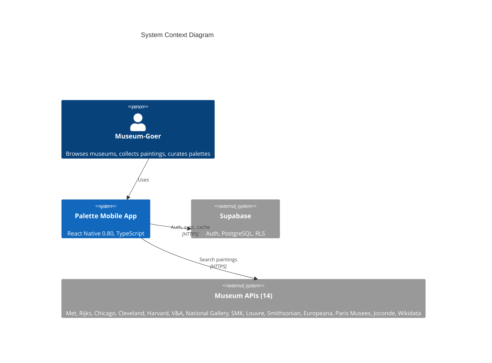
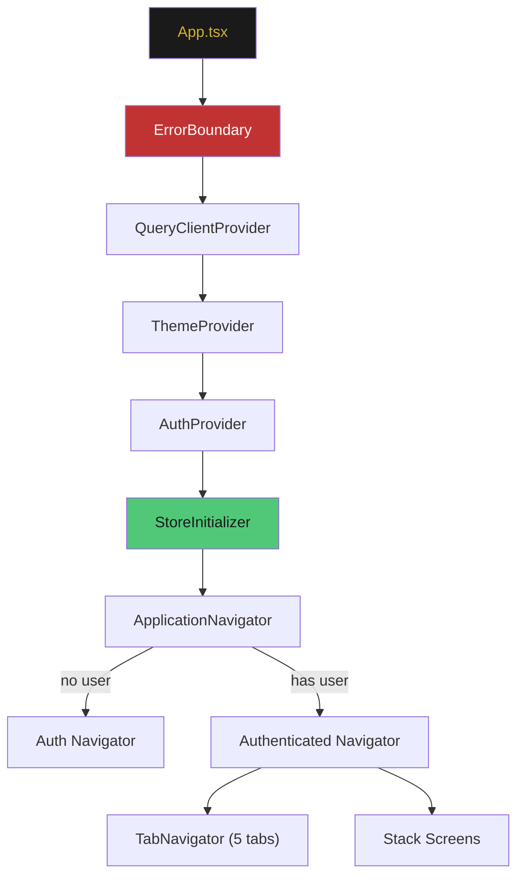
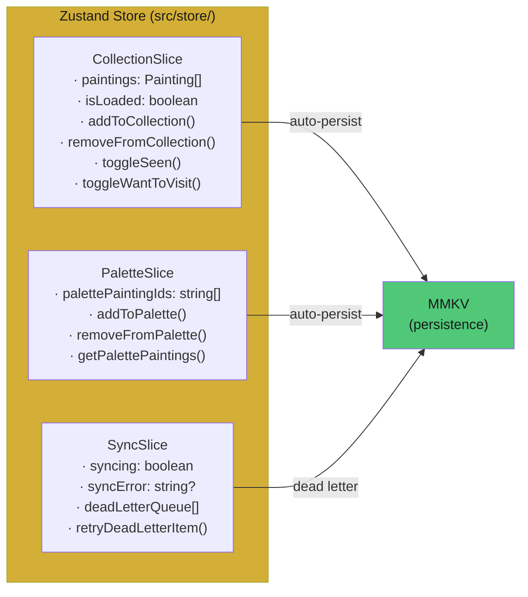
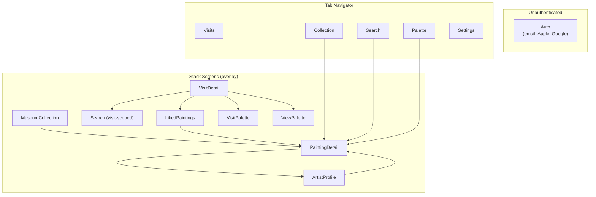
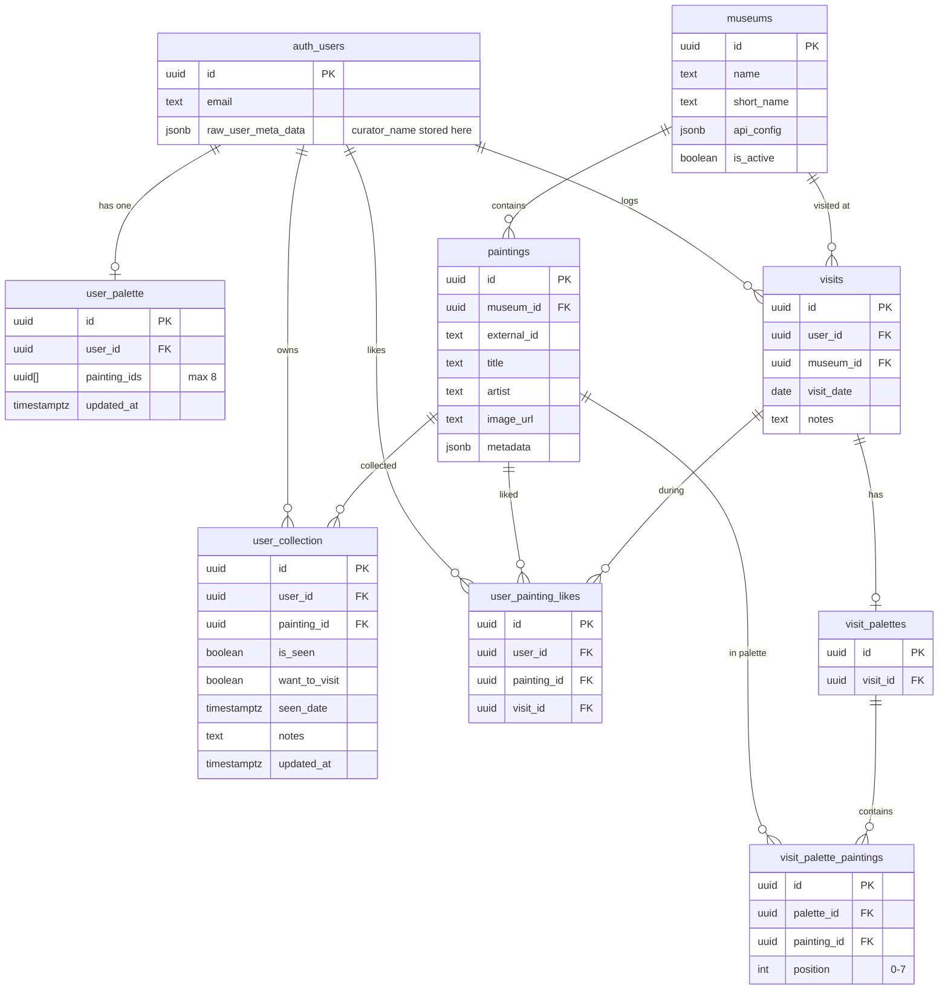
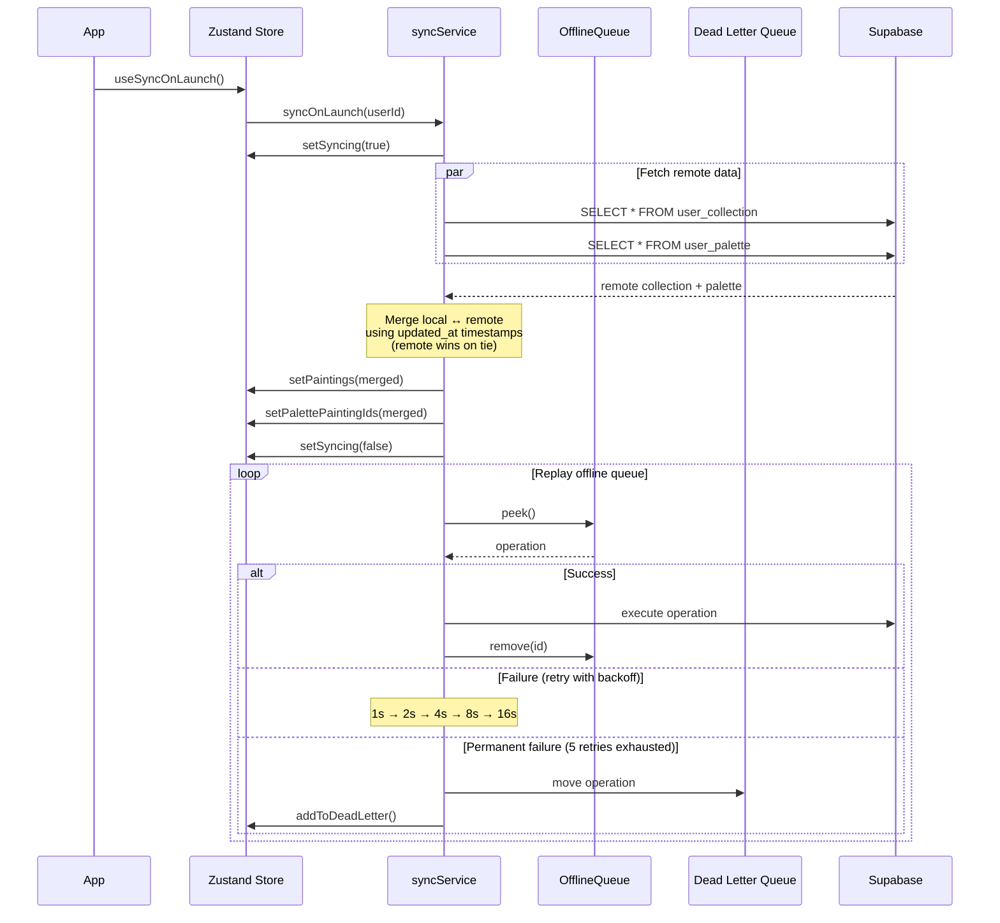
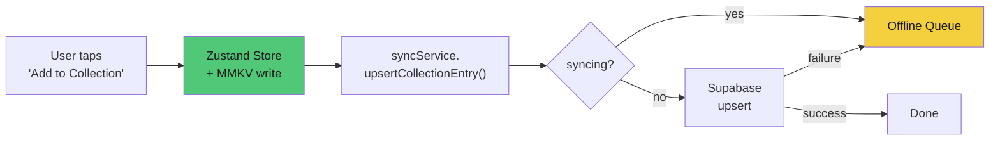
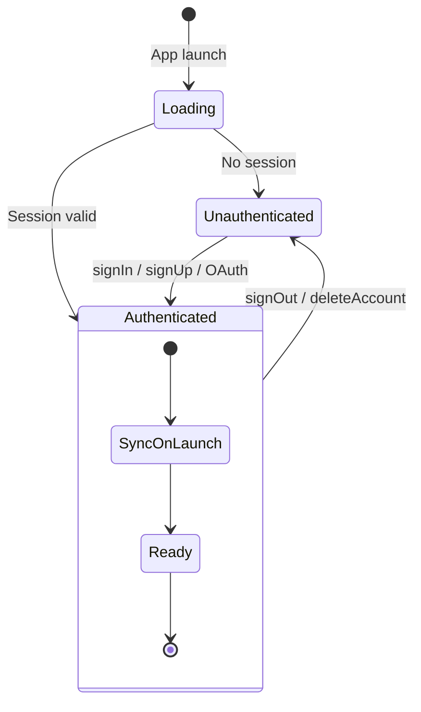
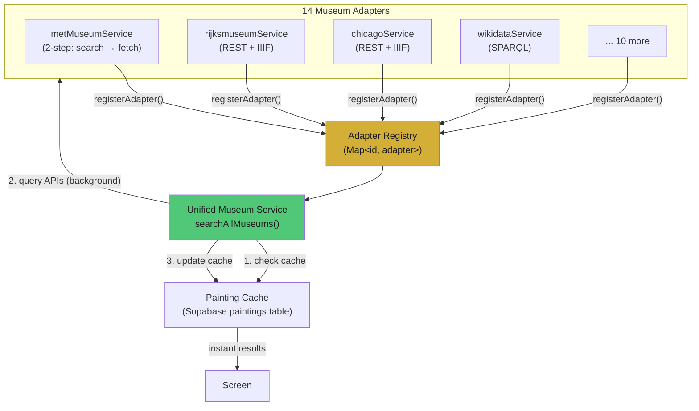
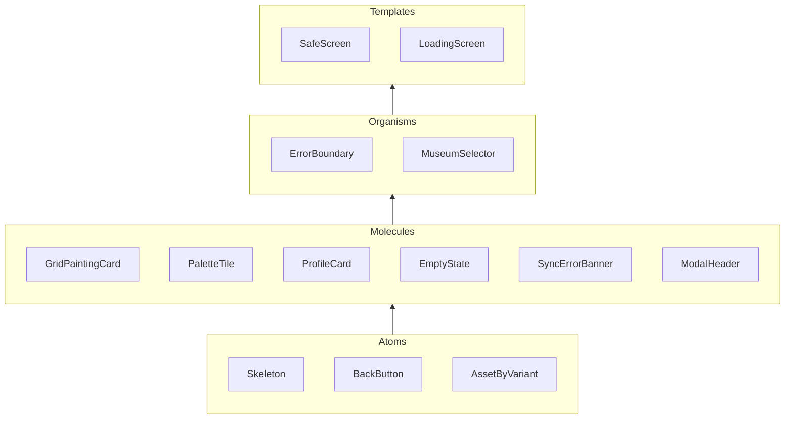

# Palette - System Design Document

> **Last updated:** 2026-05-07
> **Status:** Living document - reflects current implementation

---

## 1. High-Level Architecture

Palette is a mobile app (iOS + Android) that lets users search museum paintings, curate a personal
collection, and build a shareable "palette" of 8 favorites. It operates offline-first with cloud
sync.



### Deployment Topology

```
┌─────────────────────────────────────────────────────────────────┐
│                     USER'S DEVICE                                │
│                                                                 │
│  ┌──────────────────────────────────────────────────────────┐   │
│  │              React Native App (single binary)            │   │
│  │                                                          │   │
│  │  ┌─────────┐  ┌──────────┐  ┌────────────────────────┐  │   │
│  │  │ Zustand │  │ Offline  │  │   MMKV Storage         │  │   │
│  │  │  Store  │──│  Queue   │──│ (persists across       │  │   │
│  │  │         │  │          │  │  app launches)         │  │   │
│  │  └────┬────┘  └────┬─────┘  └────────────────────────┘  │   │
│  │       │            │                                     │   │
│  │  ┌────┴────────────┴─────────────────────────────────┐   │   │
│  │  │        Museum Adapter Layer (14 adapters)          │   │   │
│  │  └───────────────────────┬───────────────────────────┘   │   │
│  └──────────────────────────┼───────────────────────────────┘   │
└─────────────────────────────┼───────────────────────────────────┘
                              │ HTTPS
              ┌───────────────┴───────────────┐
              │                               │
     ┌────────▼────────┐          ┌───────────▼───────────┐
     │    Supabase      │          │   Museum APIs (14)    │
     │                  │          │                       │
     │  · PostgreSQL    │          │  Public REST / SPARQL │
     │  · Auth (OAuth)  │          │  No credentials      │
     │  · Row Security  │          │  needed for most     │
     │  · Edge Funcs    │          │                       │
     └──────────────────┘          └───────────────────────┘
```

---

## 2. Client Architecture

### 2.1 Component Tree



### 2.2 State Management

The app uses **Zustand** (1.1 KB) with a single store composed of three slices:



**Design decision:** Zustand over React Context because:
- Selector-based subscriptions (components only re-render when their slice changes)
- No provider nesting required
- State accessible outside React (sync service reads/writes directly)
- Simpler than Redux, no boilerplate

### 2.3 Screen Map



---

## 3. Data Architecture

### 3.1 Database Schema (Supabase PostgreSQL)



### 3.2 Key Constraints

| Constraint       | Table                     | Rule                                 |
|------------------|---------------------------|--------------------------------------|
| Mutual exclusion | `user_collection`         | `NOT (is_seen AND want_to_visit)`    |
| Palette size     | `user_palette`            | `array_length(painting_ids, 1) <= 8` |
| Position range   | `visit_palette_paintings` | `position >= 0 AND position < 8`     |
| Unique entry     | `user_collection`         | `UNIQUE (user_id, painting_id)`      |
| Unique painting  | `paintings`               | `UNIQUE (museum_id, external_id)`    |

### 3.3 Row Level Security

Every user-scoped table has RLS policies ensuring `auth.uid() = user_id`. The `paintings`,
`museums`, and `search_cache` tables are globally readable (public data).

---

## 4. Sync System Design

### 4.1 Overview

The app is offline-first: mutations hit local storage instantly, then sync to the cloud
asynchronously. The sync system handles conflicts, retries, and permanent failures.

### 4.2 Sync-on-Launch Flow



### 4.3 Mutation Flow (user action)



### 4.4 Conflict Resolution

| Scenario                       | Rule                                    |
|--------------------------------|-----------------------------------------|
| Entry in both local and remote | Compare `updated_at` — newer wins       |
| Timestamps equal (tie)         | Remote wins                             |
| Entry only in local            | Keep (will push to remote on next sync) |
| Entry only in remote           | Add to local                            |

### 4.5 Dead Letter Queue

Operations that fail after 5 retries with exponential backoff are moved to a dead-letter queue:
- Persisted in MMKV (`sync_dead_letter_queue` key)
- Visible in Settings screen with item count
- User can "Retry All" or "Discard"

---

## 5. Authentication Design

### 5.1 Supported Methods

| Method           | Provider       | Platform                           |
|------------------|----------------|------------------------------------|
| Email + password | Supabase Auth  | All                                |
| Apple Sign-In    | Supabase OAuth | iOS (required by App Store)        |
| Google Sign-In   | Supabase OAuth | All                                |
| Password reset   | Supabase email | All                                |
| Account deletion | Custom RPC     | All (required by App Store / GDPR) |

### 5.2 Auth Flow



### 5.3 Identity Model

| Layer                | Storage                                  | Purpose                          |
|----------------------|------------------------------------------|----------------------------------|
| Auth session         | MMKV (encrypted)                         | JWT tokens, refresh              |
| User ID              | Supabase `auth.users.id`                 | Foreign key for all user data    |
| Curator name         | Supabase `auth.users.raw_user_meta_data` | Display name, survives reinstall |
| Curator name (cache) | MMKV `curator_name_{userId}`             | Offline access                   |

### 5.4 Account Deletion

Calls `supabase.rpc('delete_user')` which:
1. Deletes all rows from `user_collection`, `user_palette`, `user_painting_likes`, `visits`
2. Deletes the `auth.users` row (ends session permanently)

---

## 6. Museum API Adapter Design

### 6.1 Pattern

Each museum API is wrapped by an adapter that normalizes its response into a standard `Painting`
type. Adapters self-register on import.



### 6.2 Adapter Interface

```typescript
interface MuseumServiceAdapter {
  museumId: string;
  search(params: {
    query: string;
    type: 'artist' | 'title';
    limit?: number;
  }): Promise<Painting[]>;
}
```

### 6.3 Museum Tiers

| Tier        | Museums                                                  | Behavior                           |
|-------------|----------------------------------------------------------|------------------------------------|
| 1 (default) | Met, Rijksmuseum, Chicago, Cleveland                     | Searched by default, most reliable |
| 2           | Harvard, V&A, National Gallery, SMK, Louvre, Smithsonian | Opt-in, good coverage              |
| 3           | Europeana, Paris Musees, Joconde, Wikidata               | Aggregators, complex APIs          |

### 6.4 Search Strategy

1. **Cache-first:** Check Supabase `paintings` table for cached results (instant)
2. **API in background:** Query selected museum APIs in parallel
3. **Deduplicate:** Same painting from multiple sources → keep best quality
4. **Cache update:** Store new results in Supabase for next time

---

## 7. Offline-First Design

### 7.1 Storage Layout

| MMKV Instance   | Keys                         | Purpose                          |
|-----------------|------------------------------|----------------------------------|
| Default         | `paintings_collection`       | Full painting array (Painting[]) |
| Default         | `palette_painting_ids`       | Palette UUID array               |
| Default         | `sync_last_sync_at`          | Last successful sync timestamp   |
| Default         | `sync_collection_updated_at` | Per-painting timestamp map       |
| Default         | `sync_dead_letter_queue`     | Failed operations                |
| `sync-queue`    | `sync_offline_queue`         | Pending operations               |
| `supabase-auth` | Session keys                 | Auth tokens                      |

### 7.2 Why Offline-First?

Museums have thick walls and poor connectivity. If the app required internet for every action, it
would be unusable in the exact place people need it most. Every user action succeeds instantly via
MMKV, then syncs when possible.

---

## 8. Component Architecture (Atomic Design)



### Key Components

| Component          | Purpose                     | Key Props                                                |
|--------------------|-----------------------------|----------------------------------------------------------|
| `GridPaintingCard` | Thumbnail card in grids     | `painting`, `variant` (museum/status/minimal), `onPress` |
| `PaletteTile`      | Single slot in 3x3 palette  | `imageUrl`, `title`, `artist`, `size`, `badge?`          |
| `ProfileCard`      | Center card in palette grid | `profile`, `isFlipped`, `onPress`                        |
| `EmptyState`       | Shown when list is empty    | `icon`, `title`, `subtitle`, `action?`                   |
| `ErrorBoundary`    | Catches render errors       | `fallback?`, `onReset?`                                  |
| `MuseumSelector`   | Multi-select museum picker  | `selected`, `onChange`, `grouped by tier`                |

---

## 9. Design Language

### Art Deco Visual Identity

| Token      | Hex       | Usage                                |
|------------|-----------|--------------------------------------|
| Gold       | `#d4af37` | Primary accent, buttons, active tabs |
| Black      | `#1a1a1a` | Backgrounds                          |
| Cream      | `#f5f5dc` | Light surfaces, cards                |
| Emerald    | `#50c878` | "Seen" status                        |
| Gold Light | `#f4d03f` | "Want to Visit" status               |
| Danger     | `#e63946` | Destructive actions                  |

### Typography Rules

- Titles: UPPERCASE, `letterSpacing: 2`, bold
- Dividers: `◆` diamond character
- Proportions: 1.3:1 card aspect ratio (Art Deco geometric)

---

## 10. Security Model

### Threat Mitigations

| Threat                   | Mitigation                                                       |
|--------------------------|------------------------------------------------------------------|
| Unauthorized data access | Supabase RLS: `auth.uid() = user_id` on all user tables          |
| API key exposure         | Keys loaded from `.env` via `react-native-config`, never bundled |
| Session hijacking        | Supabase auto-refreshes tokens; MMKV encryption for auth storage |
| Cross-user data leak     | No client-side admin access; RLS enforces isolation              |
| Account data retention   | `delete_user()` RPC wipes all tables + auth record               |

### API Keys

| Service     | Key location                                | Fallback behavior                 |
|-------------|---------------------------------------------|-----------------------------------|
| Supabase    | `.env` `SUPABASE_URL` + `SUPABASE_ANON_KEY` | App throws on missing (hard fail) |
| Rijksmuseum | `.env` `RIJKSMUSEUM_API_KEY`                | Service disabled                  |
| Smithsonian | `.env` `SMITHSONIAN_API_KEY`                | Falls back to `DEMO_KEY`          |
| Harvard     | `.env` `HARVARD_API_KEY`                    | Service disabled                  |

---

## 11. Technology Decisions

| Decision         | Choice           | Alternatives Considered    | Rationale                                                         |
|------------------|------------------|----------------------------|-------------------------------------------------------------------|
| State management | Zustand          | Redux, MobX, React Context | 1.1 KB, selector subscriptions, no providers, works outside React |
| Local storage    | MMKV             | AsyncStorage, SQLite       | 30x faster than AsyncStorage, synchronous reads                   |
| HTTP client      | ky               | axios, fetch               | Built-in retry, timeout, hooks; tiny bundle                       |
| Backend          | Supabase         | Firebase, custom           | PostgreSQL + RLS + Auth + OAuth in one; generous free tier        |
| Navigation       | React Navigation | expo-router                | Mature, type-safe, supports stack + tabs                          |
| Images           | FastImage        | default Image              | Disk caching, priority loading, placeholder                       |
| Validation       | Zod v4           | io-ts, yup                 | TypeScript-first, small, composable                               |

---

## 12. Future Considerations

These are documented architectural decisions that haven't been implemented yet:

| Feature                         | Approach                                             | Complexity |
|---------------------------------|------------------------------------------------------|------------|
| Real-time sync                  | Supabase Realtime subscriptions on `user_collection` | Low        |
| Push notifications              | Supabase Edge Functions → Expo Push                  | Medium     |
| Image upload (custom paintings) | Supabase Storage bucket with RLS                     | Low        |
| Social features (follow, share) | New `follows` table + feed query                     | High       |
| Gamification (badges)           | Computed from collection stats, cached in `profiles` | Medium     |
| Multi-language                  | i18next already set up (EN, FR); add more JSON files | Low        |
