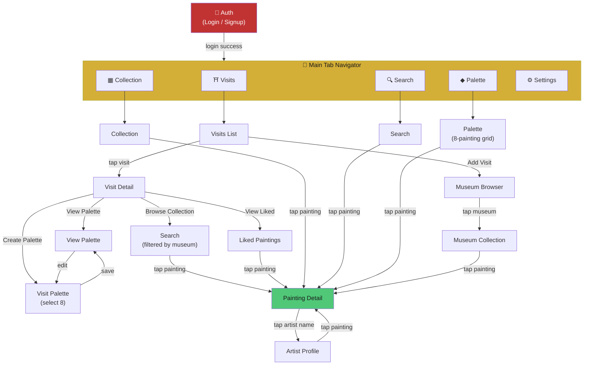
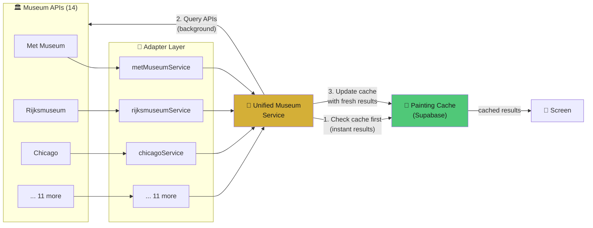
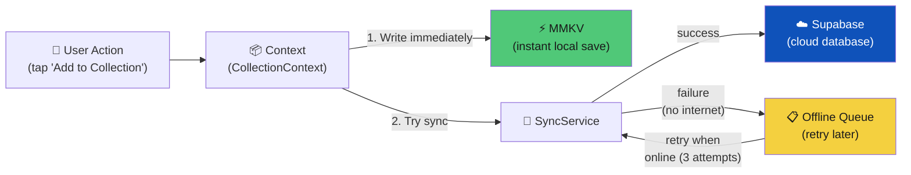
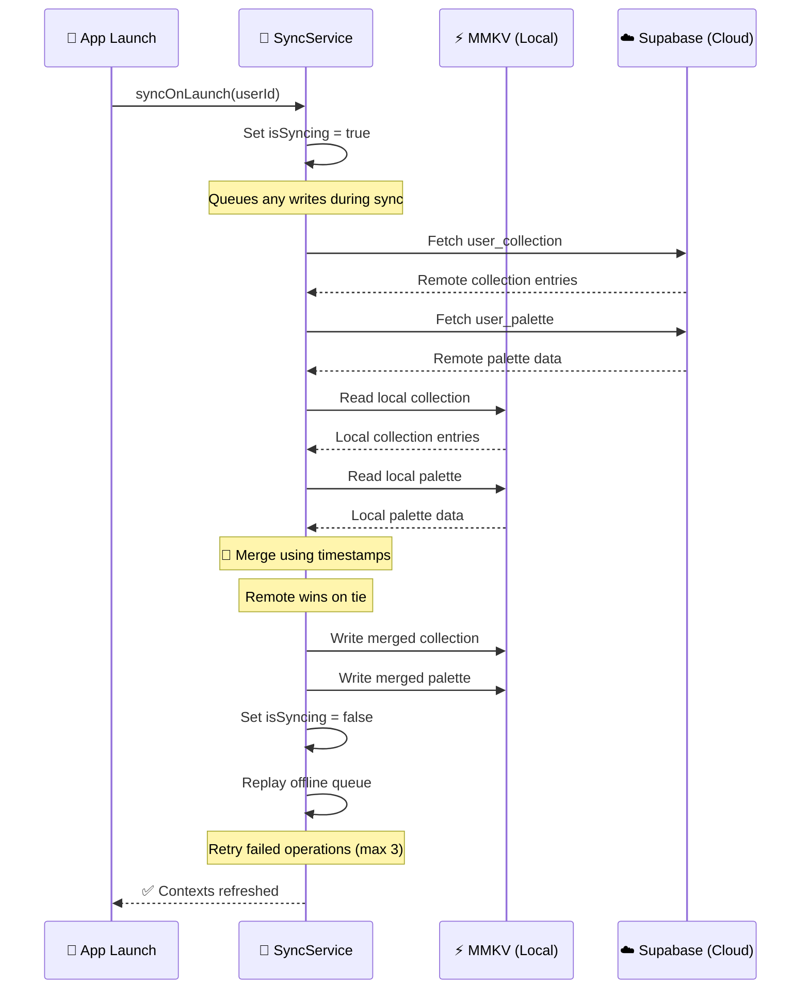
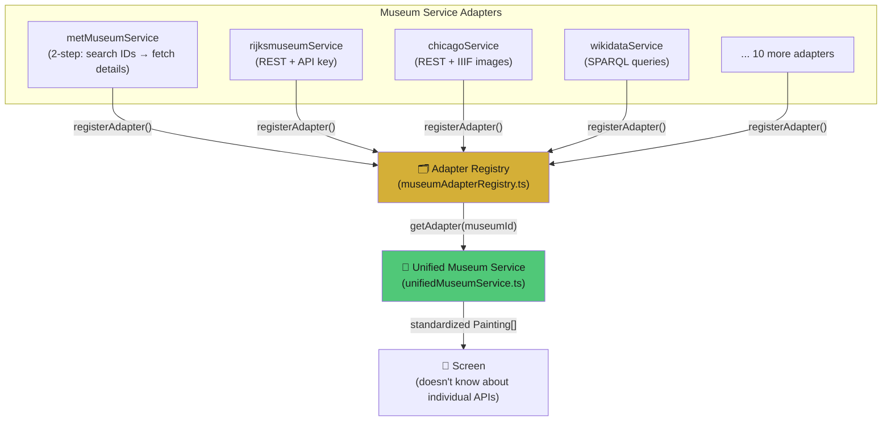
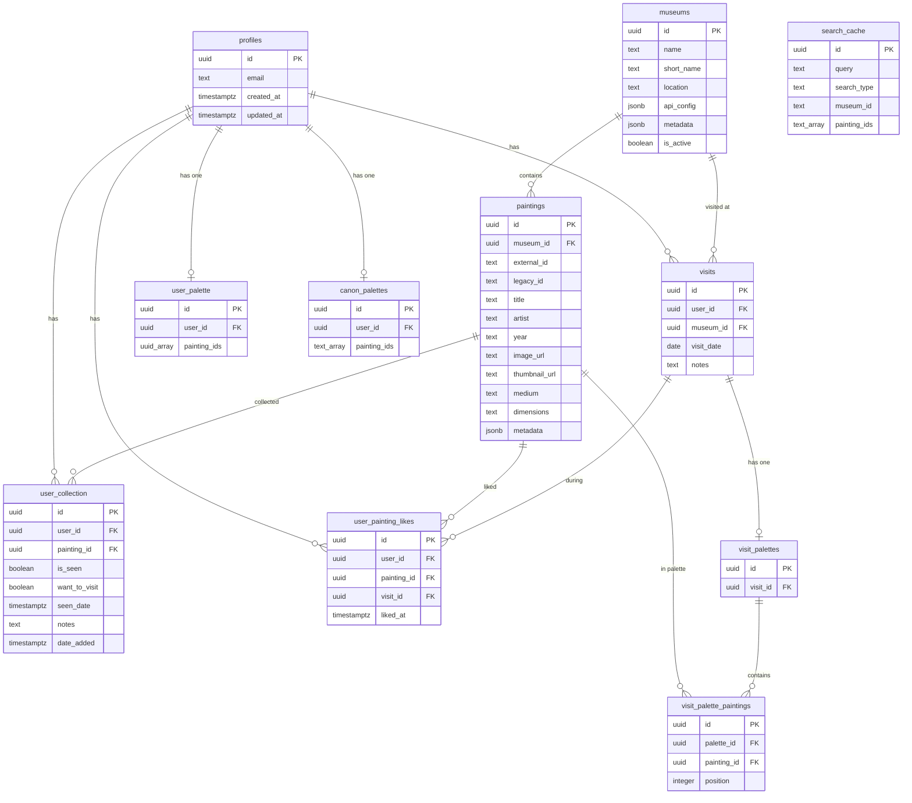
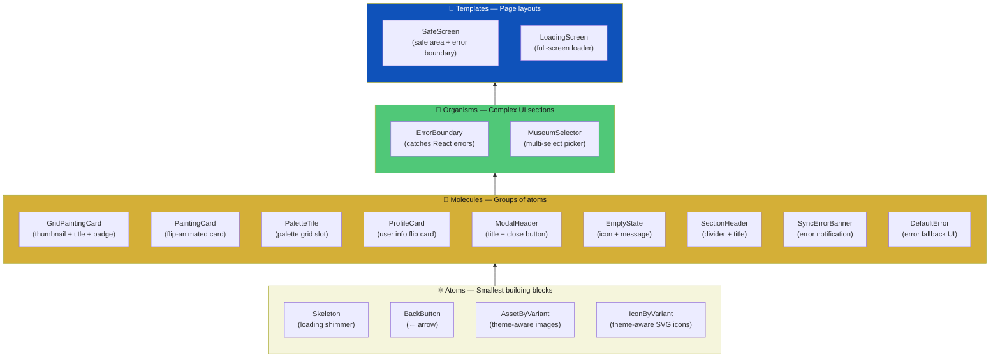
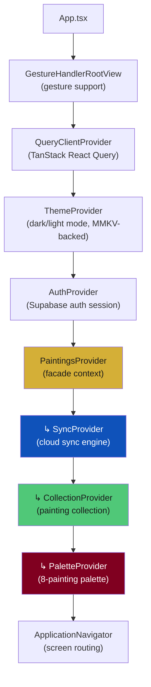
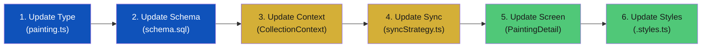

# 🎨 Palette — Developer's Guide

> **"Spotify Wrapped meets Instagram for museum-goers."**

Welcome to the Palette codebase! This guide will walk you through everything you need to know to
understand and contribute to this app — even if you've never touched React Native, TypeScript, or
mobile development before.

---

## 📑 Table of Contents

1. [What Is This App?](#1-what-is-this-app)
2. [Key Concepts for Beginners](#2-key-concepts-for-beginners)
3. [Project Structure](#3-project-structure)
4. [App Startup Flow](#4-app-startup-flow)
5. [Navigation Map](#5-navigation-map)
6. [Data Flow & Architecture](#6-data-flow--architecture)
7. [The Museum API Adapter Pattern](#7-the-museum-api-adapter-pattern)
8. [Database Schema](#8-database-schema)
9. [Component Architecture (Atomic Design)](#9-component-architecture-atomic-design)
10. [The Context System (State Management)](#10-the-context-system-state-management)
11. [Hooks Reference](#11-hooks-reference)
12. [Styles & Theme System](#12-styles--theme-system)
13. [Reusable Patterns & Code](#13-reusable-patterns--code)
14. [How to Add a New Feature (Step-by-Step)](#14-how-to-add-a-new-feature-step-by-step)
15. [Common Commands](#15-common-commands)
16. [Glossary](#16-glossary)
17. [Website & Journal](#17-website--journal)

---

## 1. What Is This App?

Palette is a **React Native mobile app** that runs on both **iOS and Android** from a single
codebase. It's built for people who love visiting museums and want to:

- **Search paintings** across 14 real museum APIs (the Met, Rijksmuseum, Art Institute of Chicago,
  the Louvre, and more)
- **Build a personal collection** — mark paintings as "Seen" or "Want to Visit"
- **Curate a Palette** — pick your top 8 paintings and display them in a beautiful 3×3 grid (like a
  personal gallery wall, with your profile card in the center)
- **Log museum visits** — record when you visited a museum, like paintings during the visit, and
  create a visit-specific palette
- **Share your palette** as an image with friends
- **Works offline** — the app saves everything locally first, then syncs to the cloud when you have
  internet again (perfect for museums with bad WiFi!)

### Tech Stack at a Glance

| Layer         | Technology                  | What It Does                                |
|---------------|-----------------------------|---------------------------------------------|
| Language      | **TypeScript**              | JavaScript with type safety                 |
| Framework     | **React Native 0.80**       | Build iOS + Android apps from one codebase  |
| Navigation    | **React Navigation**        | Screen routing (stack + tabs)               |
| Server State  | **TanStack React Query v5** | Caching and fetching remote data            |
| Local Storage | **MMKV**                    | Blazing-fast key-value storage on the phone |
| Backend       | **Supabase**                | Cloud database + authentication             |
| HTTP Client   | **ky**                      | Makes API calls to museum servers           |
| Translations  | **i18next**                 | Multi-language support (English, French)    |
| Validation    | **Zod v4**                  | Runtime data validation                     |
| Images        | **React Native Fast Image** | Optimized image loading                     |
| Sharing       | **View Shot + RN Share**    | Capture palette as image and share          |

### Design Language

The app uses an **Art Deco** visual theme inspired by 1920s–1930s design:

| Element                | Value          | Hex       |
|------------------------|----------------|-----------|
| Gold (primary accent)  | `COLORS.gold`  | `#d4af37` |
| Black (backgrounds)    | `COLORS.black` | `#1a1a1a` |
| Cream (light surfaces) | `COLORS.cream` | `#f5f5dc` |

You'll see uppercase titles, ornamental dividers (`◆`), geometric proportions, and gold-on-black
styling throughout the app.

---

## 2. Key Concepts for Beginners

If you're new to mobile development, this section explains every concept you'll encounter in the
codebase. Feel free to skip ahead if you already know some of these!

### React Native

**What it is:** A framework created by Meta (Facebook) that lets you build real mobile apps for iOS
and Android using JavaScript/TypeScript. Unlike a website that runs in a browser, React Native
creates actual native mobile components — real buttons, real scroll views, real text inputs.

**How it differs from web React:**

- Instead of `<div>`, you use `<View>`
- Instead of `<p>` or `<span>`, you use `<Text>`
- Instead of CSS files, you use `StyleSheet.create()` (more on this in Section 12)
- Instead of a browser, your code runs on a phone

**What is JSX/TSX?** It's a syntax that lets you write UI code that looks like HTML inside your
JavaScript/TypeScript:

```tsx
// This is TSX (TypeScript + JSX)
function HelloWorld() {
  return (
    <View style={styles.container}>
      <Text style={styles.title}>Hello, Museum Lover!</Text>
    </View>
  );
}
```

### TypeScript

**What it is:** TypeScript is JavaScript with **types**. Types tell the computer (and other
developers) what shape your data has.

**Why it helps:** It catches bugs before your code even runs. If you try to pass a number where a
string is expected, TypeScript will warn you immediately.

```typescript
// An interface defines the shape of an object
interface Painting {
  id: string;
  title: string;
  artist: string;
  year: string;
  imageUrl: string;
  isSeen: boolean;
}

// Type annotations tell TypeScript what type a variable is
const myPainting: Painting = {
  id: '123',
  title: 'Starry Night',
  artist: 'Vincent van Gogh',
  year: '1889',
  imageUrl: 'https://example.com/starry-night.jpg',
  isSeen: true,
};

// TypeScript will yell at you if you do this:
// myPainting.title = 42;  // ❌ Error: Type 'number' is not assignable to type 'string'
```

### Components

**What they are:** Components are the building blocks of a React Native app. Every piece of UI — a
button, a card, a whole screen — is a component. Think of them like LEGO bricks.

**Props** are inputs you pass to a component (like function arguments):

```tsx
// This component accepts 'title' and 'artist' as props
function PaintingLabel({ title, artist }: { title: string; artist: string }) {
  return (
    <View>
      <Text>{title}</Text>
      <Text>by {artist}</Text>
    </View>
  );
}

// Using it:
<PaintingLabel title="Starry Night" artist="Van Gogh" />;
```

**State** is data that can change over time (like whether a checkbox is checked):

```tsx
function LikeButton() {
  const [liked, setLiked] = useState(false); // state starts as false

  return (
    <TouchableOpacity onPress={() => setLiked(!liked)}>
      <Text>{liked ? '❤️' : '🤍'}</Text>
    </TouchableOpacity>
  );
}
```

### Hooks

Hooks are special functions that let components "hook into" React features. They always start with
`use`. Here are the ones you'll see in Palette:

| Hook          | What It Does                                                      | Example                                                          |
|---------------|-------------------------------------------------------------------|------------------------------------------------------------------|
| `useState`    | Stores a value that can change                                    | `const [count, setCount] = useState(0)`                          |
| `useEffect`   | Runs code when something changes (like "on page load")            | `useEffect(() => { fetchData() }, [])`                           |
| `useContext`  | Reads shared data from a Context (see below)                      | `const { user } = useContext(AuthContext)`                       |
| `useMemo`     | Caches an expensive calculation so it doesn't re-run every render | `const sorted = useMemo(() => paintings.sort(...), [paintings])` |
| `useCallback` | Caches a function so it doesn't get recreated every render        | `const handlePress = useCallback(() => { ... }, [])`             |

### Context API

**The problem:** Imagine you have user data at the top of your app, but a component 5 levels deep
needs it. Without Context, you'd have to pass it through every component in between — this is called
**"prop drilling"** and it's messy.

**The solution:** Context lets you create a "global" value that any component can access directly,
no matter how deep it is.

```
Without Context (prop drilling):          With Context:
App → user → Screen → user →             App (provides user via Context)
  Layout → user → Card → user →            ...any component...
    Button (finally uses user!)               Button (reads user from Context!)
```

In Palette, we use contexts for authentication (`AuthContext`), the painting collection (
`CollectionContext`), the palette (`PaletteContext`), and cloud sync (`SyncContext`).

### Navigation

Navigation is how users move between screens. Palette uses two types:

- **Stack Navigator:** Screens are stacked like a deck of cards. When you navigate to a new screen,
  it slides on top. Press "back" and it slides away, revealing the previous screen. (Think: tapping
  a painting → painting detail screen)
- **Tab Navigator:** A bar at the bottom of the screen with tabs. Tapping a tab switches to that
  screen instantly. Palette has 5 tabs: Visits, Collection, Search, Palette, Settings.

### Async/Await

Many operations in JavaScript take time — fetching data from the internet, reading from a database,
etc. These are **asynchronous** operations. `async/await` is a way to write asynchronous code that
reads like normal, synchronous code:

```typescript
// Without async/await (callback hell):
fetch(url)
  .then((response) => response.json())
  .then((data) => console.log(data));

// With async/await (clean and readable):
async function getPainting() {
  const response = await fetch(url); // Wait for the response
  const data = await response.json(); // Wait for the JSON parsing
  console.log(data); // Now use the data
}
```

### Offline-First Architecture

**What it means:** The app saves data to the phone first (using MMKV), then tries to sync it to the
cloud (Supabase) in the background. If there's no internet, the data is queued and synced later.

**Why it matters:** Museum-goers are often in buildings with thick walls and terrible WiFi. If the
app required internet for every action, it would be unusable in the exact place people need it most!

---

## 3. Project Structure

Here's the complete folder layout with explanations of what each piece does:

```
src/
├── App.tsx                          # Root component — sets up all providers
├── reactotron.config.ts             # Dev tools configuration
│
├── navigation/                      # Screen routing (which screen shows when)
│   ├── Application.tsx              # Auth-gated root navigator
│   ├── TabNavigator.tsx             # Bottom tab bar (5 tabs)
│   ├── paths.ts                     # Route name constants (enum)
│   └── types.ts                     # TypeScript route param types
│
├── screens/                         # 15 full-page views
│   ├── Auth/                        # Login / signup
│   ├── Search/                      # Multi-museum painting search
│   ├── Collection/                  # User's painting collection
│   ├── Palette/                     # 8-painting curated display
│   ├── PaintingDetail/              # Single painting view
│   ├── Visits/                      # Museum visit log
│   ├── VisitDetail/                 # Single visit details
│   ├── MuseumBrowser/               # Browse museums by tier
│   ├── MuseumCollection/            # Browse a museum's paintings
│   ├── LikedPaintings/              # Paintings liked during a visit
│   ├── VisitPalette/                # Create visit palette (select 8)
│   ├── ViewPalette/                 # View / share visit palette
│   ├── ArtistProfile/               # Artist page with all works
│   ├── Settings/                    # Account & app settings
│   └── Startup/                     # Loading splash screen
│
├── components/                      # Reusable UI pieces (Atomic Design)
│   ├── atoms/                       # Smallest pieces (Skeleton, BackButton)
│   ├── molecules/                   # Composed pieces (PaintingCard, EmptyState)
│   ├── organisms/                   # Complex pieces (ErrorBoundary, MuseumSelector)
│   └── templates/                   # Page layouts (SafeScreen, LoadingScreen)
│
├── contexts/                        # Global state management
│   ├── AuthContext.tsx               # User authentication state
│   ├── CollectionContext.tsx         # Painting collection CRUD
│   ├── PaletteContext.tsx            # 8-painting palette state
│   ├── SyncContext.tsx               # Cloud sync engine
│   └── PaintingsContext.tsx          # Facade combining Collection+Palette+Sync
│
├── hooks/                           # Custom React hooks
│   └── domain/                      # Business logic hooks
│       ├── collection/              # useCollection, useCollectionFilter, usePaintingDetail
│       ├── museum/                  # useMuseumSearch, useMuseumCollection, useSearch
│       ├── visits/                  # useVisits, useVisitDetail, useLikedPaintings
│       └── user/                    # useUser
│
├── services/                        # API calls & data layer
│   ├── supabase.ts                  # Supabase client setup
│   ├── sync/                        # Sync engine
│   │   ├── syncStrategy.ts          # Bidirectional sync logic
│   │   ├── conflictResolver.ts      # Merge conflicts (timestamp-based)
│   │   └── offlineStorage.ts        # MMKV read/write helpers
│   ├── offlineQueue.ts              # Queue for failed operations
│   ├── unifiedMuseumService.ts      # Search across all museums
│   ├── paintingCacheService.ts      # Supabase painting cache
│   ├── museumRegistry.ts            # Museum metadata registry
│   ├── museumAdapterRegistry.ts     # Adapter pattern registry
│   ├── museumApiClient.ts           # Shared HTTP client (ky)
│   ├── museumCache.ts               # Legacy ID → UUID mapping
│   ├── metMuseumService.ts          # Metropolitan Museum adapter
│   ├── chicagoService.ts            # Art Institute of Chicago adapter
│   ├── rijksmuseumService.ts        # Rijksmuseum adapter
│   ├── harvardService.ts            # Harvard Art Museums adapter
│   ├── clevelandService.ts          # Cleveland Museum adapter
│   ├── smithsonianService.ts        # Smithsonian adapter
│   ├── nationalGalleryService.ts    # National Gallery UK adapter
│   ├── louvreService.ts             # Musée du Louvre adapter
│   ├── europeanaService.ts          # Europeana adapter
│   ├── smkService.ts                # SMK Denmark adapter
│   ├── parisMuseumsService.ts       # Paris Musées adapter
│   ├── jocondeService.ts            # Joconde adapter
│   ├── wikidataService.ts           # Wikidata adapter
│   ├── vaService.ts                 # V&A Museum adapter
│   ├── paintings.service.ts         # Painting CRUD service
│   ├── likes.service.ts             # Like/unlike service
│   ├── palettes.service.ts          # Visit palette service
│   ├── visits.service.ts            # Visit CRUD service
│   └── auth.service.ts              # User profile service
│
├── types/                           # TypeScript type definitions
│   ├── painting.ts                  # Core Painting type
│   └── database.ts                  # Database table types
│
├── constants/                       # Colors, dimensions, museum metadata
│   ├── colors.ts                    # Art Deco color palette
│   ├── dimensions.ts                # Spacing, grid, card sizes
│   └── museums.ts                   # Museum badge info
│
├── styles/                          # Shared style objects
│   ├── typography.ts                # Text styles (headings, body, captions)
│   ├── buttons.ts                   # Button variants
│   ├── cards.ts                     # Card styles
│   ├── badges.ts                    # Badge styles
│   └── shared.ts                    # Common patterns (containers, separators)
│
├── theme/                           # Theme system (dark/light mode)
│   ├── ThemeProvider/               # React context for theming
│   ├── _config.ts                   # Theme configuration
│   ├── layout.ts                    # Layout styles
│   ├── fonts.ts                     # Font styles
│   ├── gutters.ts                   # Gutter/margin styles
│   ├── borders.ts                   # Border styles
│   ├── backgrounds.ts               # Background styles
│   ├── components.ts                # Component-level theme styles
│   └── hooks/useTheme.ts            # Consumer hook
│
├── translations/                    # i18n strings
│   └── en-EN/                       # English translations
│
├── utils/                           # Helper functions
│   ├── colorGenerator.ts            # Deterministic color from string
│   ├── formatting.ts                # Date/number formatting
│   ├── image.ts                     # Image URL utilities
│   └── imageSource.ts               # URL → ImageSource converter
│
└── data/                            # Mock data for development
```

---

## 4. App Startup Flow

When a user opens Palette, here's exactly what happens, step by step:

```mermaid
flowchart TD
    A["📱 User taps app icon"] --> B["index.js loads"]
    B --> C["Load polyfills\n(URL polyfill, crypto)"]
    C --> D["enableScreens()\nfor native navigation"]
    D --> E["AppRegistry.registerComponent()\nregisters App"]
    E --> F["App.tsx renders"]

    F --> G["GestureHandlerRootView\n(enables swipe gestures)"]
    G --> H["QueryClientProvider\n(TanStack React Query)"]
    H --> I["ThemeProvider\n(dark/light mode from MMKV)"]
    I --> J["AuthProvider\n(Supabase auth session)"]
    J --> K["PaintingsProvider\n(Collection + Palette + Sync)"]
    K --> L["ApplicationNavigator"]

    L --> M{Has authenticated\nuser?}
    M -->|No| N["🔐 Auth Screen\n(login / signup)"]
    M -->|Yes| O["Startup Screen\n(splash + loading)"]

    O --> P["Run init query\n(useQuery)"]
    P --> Q["SyncContext runs\nsyncOnLaunch()"]
    Q --> R["Fetch remote data\nfrom Supabase"]
    R --> S["Merge local ↔ remote\n(timestamp-based)"]
    S --> T["Refresh contexts\n(Collection + Palette)"]
    T --> U["🏠 Navigate to Main\n(Tab Navigator)"]

    N -->|"User logs in"| O

    style A fill:#d4af37,color:#1a1a1a
    style U fill:#50c878,color:#1a1a1a
    style N fill:#c13333,color:#ffffff
```



### What Each Provider Does

The providers wrap around each other like Russian nesting dolls. Each one makes something available
to all the components inside it:

1. **GestureHandlerRootView** — Enables swipe gestures (like swiping back to the previous screen)
2. **QueryClientProvider** — Sets up TanStack React Query for caching API responses
3. **ThemeProvider** — Reads the user's theme preference from MMKV and provides it to all components
4. **AuthProvider** — Connects to Supabase auth, tracks login state, provides `signIn`/`signUp`/
   `signOut`
5. **PaintingsProvider** — The big one! Combines three sub-providers:
   - **SyncProvider** — Manages the sync engine
   - **CollectionProvider** — Manages the user's painting collection
   - **PaletteProvider** — Manages the 8-painting palette
6. **ApplicationNavigator** — The navigation tree that decides which screen to show

### The Startup Screen

The Startup screen is a brief splash screen that:

1. Shows the Palette logo and a loading spinner
2. Runs an initialization query via `useQuery`
3. Waits for `syncOnLaunch()` to complete (merging local and remote data)
4. Resets the navigation stack to the Main tab navigator

---

## 5. Navigation Map

Here's how all 15+ screens connect to each other. Arrows show navigation paths — which screen you
can reach from which:



### Tab Bar Layout

The bottom tab bar has 5 tabs, styled with the Art Deco theme:

| Tab        | Icon | Screen     | Purpose                           |
|------------|------|------------|-----------------------------------|
| Visits     | ⛩    | Visits     | Log and browse museum visits      |
| Collection | ▦    | Collection | Your personal painting collection |
| Search     | 🔍   | Search     | Search across 14 museum APIs      |
| Palette    | ◆    | Palette    | Your curated 8-painting display   |
| Settings   | ⚙    | Settings   | Account and app settings          |

---

## 6. Data Flow & Architecture

This is the most important section for understanding how data moves through the app. There are two
main data pipelines: **museum data** (paintings from external APIs) and **user data** (your
collection, palette, visits).

### 6a. Museum Data Flow

When a user searches for paintings, here's what happens:



**The flow in plain English:**

1. User types "Monet" in the search bar
2. `unifiedMuseumService` first checks the Supabase `search_cache` table — if we've searched "Monet"
   before, show those results instantly
3. In the background, it queries all 14 museum APIs in parallel
4. Each museum adapter transforms its unique API response into the standard `Painting` type
5. Results are deduplicated, quality-filtered, sorted by relevance, and cached in Supabase
6. The screen updates with fresh results

### 6b. User Data Flow (Offline-First)

When a user interacts with their collection or palette:



**The flow in plain English:**

1. User taps "Add to Collection" on a painting
2. `CollectionContext` immediately writes to MMKV (local storage) — the UI updates instantly
3. In the background, `SyncService` tries to write to Supabase
4. If it succeeds, great — local and cloud are in sync
5. If it fails (no internet), the operation is added to the `OfflineQueue`
6. When the app detects connectivity, it replays the queue (up to 3 retries per operation)

### 6c. The Sync System (Explained in Detail)

This is the heart of the offline-first architecture. Let's break it down piece by piece.

#### What is MMKV?

MMKV is a **fast local key-value storage** library for mobile phones. Think of it like a tiny,
super-fast database that lives on the phone itself. It's made by WeChat and is much faster than
AsyncStorage (the default React Native storage).

```typescript
// Writing to MMKV is instant — no waiting
storage.set('paintings_collection', JSON.stringify(paintings));

// Reading is also instant
const data = storage.getString('paintings_collection');
```

#### What is Supabase?

Supabase is a **cloud database** — think of it like a Google Sheet that lives on the internet. It
provides:

- A PostgreSQL database (where all user data is stored permanently)
- Authentication (login/signup)
- Row Level Security (users can only see their own data)

The key difference: MMKV is on the phone (fast but only on this device), Supabase is in the cloud (
slower but accessible from anywhere and backed up).

#### Why Offline-First?

Imagine you're in the Louvre, standing in front of the Mona Lisa. You want to mark it as "Seen" in
the app. But the Louvre has thick stone walls and terrible WiFi. With a normal app, you'd see a
loading spinner and then an error. With offline-first, the action succeeds instantly because it
saves to the phone first.

#### The Sync-on-Launch Flow

Every time the app opens, it runs a full sync to make sure local and cloud data match:



#### Conflict Resolution

What happens if you changed a painting on your phone (offline) AND someone changed it in the cloud?
This is a **conflict**. Here's how Palette resolves it:

1. **Compare timestamps** — each entry has an `updated_at` timestamp
2. **Newer timestamp wins** — if local is newer, local wins; if remote is newer, remote wins
3. **Tie goes to remote** — if timestamps are identical, the cloud version wins (it's the "source of
   truth")

```typescript
// Simplified conflict resolution logic
function mergeCollectionData(local: Entry[], remote: Entry[]): Entry[] {
  // For each painting that exists in both local and remote:
  // - Compare updated_at timestamps
  // - Keep the newer one
  // - If equal, keep remote (cloud wins on tie)
}
```

#### The Offline Queue

When a sync operation fails (no internet), it goes into the offline queue:

```typescript
// The queue stores operations like:
{
  type: 'upsert_collection',      // What kind of operation
  payload: { paintingId, isSeen }, // The data
  timestamp: '2026-04-05T12:00:00Z', // When it was queued
  retries: 0                       // How many times we've tried
}
```

The queue uses its own separate MMKV instance (`sync-queue`) so it persists even if the app crashes.
When connectivity returns, operations are replayed in order, with up to 3 retry attempts each.

---

## 7. The Museum API Adapter Pattern

### The Problem

Palette integrates with 14 different museum APIs. Each museum has its own:

- API URL (some use REST, one uses SPARQL)
- Response format (different field names, different nesting)
- Authentication (some need API keys, some don't)
- Quirks (the Met requires two API calls per painting, the Louvre uses web scraping)

If every screen had to know about all 14 APIs, the code would be an unmaintainable mess.

### The Solution: Adapter Pattern

The **adapter pattern** creates a uniform interface. Each museum service "adapts" its unique API
into the same standard shape:



### How It Works

Every museum service implements the same interface and self-registers:

```typescript
// The adapter interface (what every museum service must implement)
interface MuseumServiceAdapter {
  museumId: string;
  search: (params: SearchParams) => Promise<Painting[]>;
}

// The registry is just a Map
const adapterRegistry = new Map<string, MuseumServiceAdapter>();

export function registerAdapter(adapter: MuseumServiceAdapter): void {
  adapterRegistry.set(adapter.museumId, adapter);
}

export function getAdapter(museumId: string): MuseumServiceAdapter | undefined {
  return adapterRegistry.get(museumId);
}
```

Each museum service file registers itself when imported:

```typescript
// Example: metMuseumService.ts (simplified)
import { registerAdapter } from './museumAdapterRegistry';

async function searchMet(params: SearchParams): Promise<Painting[]> {
  // 1. Search the Met API for matching IDs
  // 2. Fetch details for each ID
  // 3. Transform Met's response format → standard Painting type
  return paintings;
}

// Self-register on import
registerAdapter({
  museumId: 'MET',
  search: searchMet,
});
```

The unified service then calls all adapters without knowing their internals:

```typescript
// unifiedMuseumService.ts (simplified)
async function searchAllMuseums(query: string): Promise<Painting[]> {
  const adapters = getAllAdapters();
  const results = await Promise.all(
    adapters.map((adapter) => adapter.search({ query })),
  );
  return deduplicateAndSort(results.flat());
}
```

### All 14 Museums

| Museum                     | Service File                | API Base URL                          | API Key? | Tier |
|----------------------------|-----------------------------|---------------------------------------|----------|------|
| Metropolitan Museum of Art | `metMuseumService.ts`       | `collectionapi.metmuseum.org`         | No       | 1    |
| Art Institute of Chicago   | `chicagoService.ts`         | `api.artic.edu`                       | No       | 1    |
| Rijksmuseum                | `rijksmuseumService.ts`     | `www.rijksmuseum.nl/api`              | Yes      | 1    |
| Cleveland Museum of Art    | `clevelandService.ts`       | `openaccess-api.clevelandart.org`     | No       | 1    |
| Harvard Art Museums        | `harvardService.ts`         | `api.harvardartmuseums.org`           | No       | 2    |
| Victoria & Albert Museum   | `vaService.ts`              | `api.vam.ac.uk`                       | No       | 2    |
| National Gallery (UK)      | `nationalGalleryService.ts` | `data.ng-london.org.uk`               | No       | 2    |
| SMK (Denmark)              | `smkService.ts`             | `api.smk.dk`                          | No       | 2    |
| Musée du Louvre            | `louvreService.ts`          | `collections.louvre.fr`               | No       | 2    |
| Smithsonian Institution    | `smithsonianService.ts`     | `api.si.edu`                          | Yes      | 2    |
| Europeana                  | `europeanaService.ts`       | `api.europeana.eu`                    | No       | 3    |
| Paris Musées               | `parisMuseumsService.ts`    | `apicollections.parismusees.paris.fr` | No       | 3    |
| Joconde (French Museums)   | `jocondeService.ts`         | `data.culture.gouv.fr`                | No       | 3    |
| Wikidata                   | `wikidataService.ts`        | `query.wikidata.org`                  | No       | 3    |

### Museum Tiers

- **Tier 1 — Best Collections:** MET, Rijksmuseum, Chicago, Cleveland. These are searched by default
  and have the most reliable APIs.
- **Tier 2 — More Museums:** Harvard, V&A, National Gallery, SMK, Louvre, Smithsonian. Good APIs,
  slightly less coverage.
- **Tier 3 — Advanced/Aggregators:** Europeana, Paris Musées, Joconde, Wikidata. These are
  aggregators or specialized databases with more complex APIs.

---

## 8. Database Schema

The backend uses **Supabase** (hosted PostgreSQL). Here are all 11 tables and how they relate to
each other:



### Table Descriptions

| Table                     | Purpose                                                | Key Fields                                                      |
|---------------------------|--------------------------------------------------------|-----------------------------------------------------------------|
| `profiles`                | Extends Supabase auth.users with app-specific data     | `id` (matches auth.users), `email`                              |
| `museums`                 | Registry of all 14 supported museums                   | `name`, `short_name`, `api_config` (JSONB), `is_active`         |
| `paintings`               | Cached paintings from museum APIs                      | `museum_id` (FK), `external_id`, `title`, `artist`, `image_url` |
| `visits`                  | User's museum visit log                                | `user_id`, `museum_id`, `visit_date`, `notes`                   |
| `user_collection`         | User's personal painting collection                    | `user_id`, `painting_id`, `is_seen`, `want_to_visit`            |
| `user_palette`            | User's curated 8-painting palette                      | `user_id`, `painting_ids` (UUID array, max 8)                   |
| `user_painting_likes`     | Paintings liked during a specific visit                | `user_id`, `painting_id`, `visit_id`                            |
| `visit_palettes`          | One palette per visit (header table)                   | `visit_id` (unique)                                             |
| `visit_palette_paintings` | Junction table: which paintings in which visit palette | `palette_id`, `painting_id`, `position` (0–7)                   |
| `canon_palettes`          | Legacy palette table (kept for reference)              | `user_id`, `painting_ids` (text array)                          |
| `search_cache`            | Cached search results for faster repeat searches       | `query`, `search_type`, `museum_id`, `painting_ids`             |

### Key Constraints

These are rules enforced by the database itself — they can't be violated:

| Constraint                 | Table                     | Rule                                                                                    |
|----------------------------|---------------------------|-----------------------------------------------------------------------------------------|
| Status exclusivity         | `user_collection`         | `NOT (is_seen AND want_to_visit)` — a painting can't be both "Seen" and "Want to Visit" |
| Max palette size           | `user_palette`            | `array_length(painting_ids, 1) <= 8` — palette can have at most 8 paintings             |
| Position range             | `visit_palette_paintings` | `position >= 0 AND position < 8` — positions 0 through 7 only                           |
| Unique collection entry    | `user_collection`         | `UNIQUE (user_id, painting_id)` — can't add the same painting twice                     |
| Unique visit               | `visits`                  | `UNIQUE (user_id, museum_id, visit_date)` — one visit per museum per day                |
| Unique painting per museum | `paintings`               | `UNIQUE (museum_id, external_id)` — no duplicate paintings                              |

### Row Level Security (RLS)

Supabase uses **Row Level Security** to ensure users can only access their own data. This is
enforced at the database level — even if someone hacks the API, they can't see other users' data:

```sql
-- Example: Users can only view their own collection
CREATE POLICY "Users can view own collection" ON public.user_collection
  FOR SELECT USING (auth.uid() = user_id);
```

Every user-specific table (`user_collection`, `user_palette`, `visits`, `user_painting_likes`) has
RLS policies for SELECT, INSERT, UPDATE, and DELETE. The `paintings` and `search_cache` tables are
globally readable (they're cached public data).

---

## 9. Component Architecture (Atomic Design)

Palette organizes its UI components using **Atomic Design** — a methodology that breaks UI into
increasingly complex layers, like chemistry:



### Atoms — The Smallest Pieces

These are the most basic UI elements. They can't be broken down further.

| Component        | File                       | What It Does                                                                                                      | Used In               |
|------------------|----------------------------|-------------------------------------------------------------------------------------------------------------------|-----------------------|
| `Skeleton`       | `atoms/Skeleton.tsx`       | Animated pulsing placeholder shown while content loads. Uses Reanimated for smooth opacity animation (0.2 → 1.0). | Loading states        |
| `BackButton`     | `atoms/BackButton.tsx`     | A "←" arrow button with accessibility label "Go back".                                                            | PaintingDetail header |
| `AssetByVariant` | `atoms/AssetByVariant.tsx` | Renders images that change based on theme (dark/light). Uses Zod for validation.                                  | Theme-aware screens   |
| `IconByVariant`  | `atoms/IconByVariant.tsx`  | Renders SVG icons that change based on theme. Default size 24×24.                                                 | DefaultError          |

### Molecules — Composed Pieces

These combine atoms and basic elements into meaningful UI groups.

| Component          | File                             | What It Does                                                                                                                                                                     | Used In                                                                      |
|--------------------|----------------------------------|----------------------------------------------------------------------------------------------------------------------------------------------------------------------------------|------------------------------------------------------------------------------|
| `GridPaintingCard` | `molecules/GridPaintingCard.tsx` | A card showing a painting thumbnail, title, artist, and year. Has 3 variants: `museum` (shows museum badge), `status` (shows S/W badges), `minimal` (no badges). Uses FastImage. | LikedPaintings, MuseumCollection                                             |
| `PaintingCard`     | `molecules/PaintingCard.tsx`     | A flip-animated card — front shows the painting image, back shows title and artist. Uses React Native Animated with spring physics. Long press navigates to PaintingDetail.      | Legacy/alternative views                                                     |
| `PaletteTile`      | `molecules/PaletteTile.tsx`      | A single slot in the 8-painting palette grid. Shows painting image with title/artist overlay. `EmptyPaletteTile` shows a "+" icon for empty slots.                               | Palette, ViewPalette                                                         |
| `ProfileCard`      | `molecules/ProfileCard.tsx`      | Flip-animated user profile card. Front: initial circle + "CURATOR" label. Back: username + painting count.                                                                       | Palette (center of 3×3 grid)                                                 |
| `ModalHeader`      | `molecules/ModalHeader.tsx`      | A reusable header for modals with a title and "✕" close button.                                                                                                                  | Visits, VisitDetail                                                          |
| `EmptyState`       | `molecules/EmptyState.tsx`       | Shown when a list is empty. Displays an emoji icon, title, optional subtitle, and optional action button.                                                                        | Collection, LikedPaintings, ViewPalette, VisitPalette, Visits, ArtistProfile |
| `SectionHeader`    | `molecules/SectionHeader.tsx`    | A centered title with decorative divider lines on each side and optional icon. Art Deco style.                                                                                   | PaintingDetail, ArtistProfile, MuseumSelector                                |
| `SyncErrorBanner`  | `molecules/SyncErrorBanner.tsx`  | A red banner that appears when sync fails. Has a dismiss button. Auto-resets when a new error occurs.                                                                            | Collection, Palette                                                          |
| `DefaultError`     | `molecules/DefaultError.tsx`     | Error fallback UI with a fire icon, error title, description, and optional reset button. Uses i18n for translations.                                                             | ErrorBoundary, SafeScreen                                                    |

### Organisms — Complex UI Sections

These are larger, more complex components that combine multiple molecules.

| Component        | File                           | What It Does                                                                                                                                                        | Used In               |
|------------------|--------------------------------|---------------------------------------------------------------------------------------------------------------------------------------------------------------------|-----------------------|
| `ErrorBoundary`  | `organisms/ErrorBoundary.tsx`  | Wraps children in React's error boundary. If any child component crashes, it catches the error and shows `DefaultError` instead of crashing the whole app.          | SafeScreen            |
| `MuseumSelector` | `organisms/MuseumSelector.tsx` | A multi-select museum picker. Shows museums grouped by tier with checkboxes. Has quick-action buttons: "Quick 4" (Tier 1), "All", "Clear". Displays selected count. | Search (inside Modal) |

### Templates — Page Layouts

These provide consistent page-level structure.

| Component       | File                          | What It Does                                                                                                                                  | Used In                      |
|-----------------|-------------------------------|-----------------------------------------------------------------------------------------------------------------------------------------------|------------------------------|
| `SafeScreen`    | `templates/SafeScreen.tsx`    | Wraps content in `SafeAreaView` (avoids notches/status bars), sets up `StatusBar` (adapts to theme), and wraps everything in `ErrorBoundary`. | Available for all screens    |
| `LoadingScreen` | `templates/LoadingScreen.tsx` | Full-screen loading view with "Palette" title, brush stroke decoration, spinner, and "Loading your collection..." subtitle.                   | Available for loading states |

---

## 10. The Context System (State Management)

Palette uses React's **Context API** for global state management. The contexts are nested inside
each other in a specific order — each one depends on the ones above it.

### Context Nesting Order



### Each Context Explained

#### AuthContext (`contexts/AuthContext.tsx`)

**What it manages:** User login state — who is logged in, their session, and auth errors.

| State       | Type              | Description                           |
|-------------|-------------------|---------------------------------------|
| `user`      | `User \| null`    | The currently logged-in Supabase user |
| `session`   | `Session \| null` | The auth session (contains tokens)    |
| `loading`   | `boolean`         | Whether auth is still initializing    |
| `authError` | `string \| null`  | Any authentication error message      |

| Action                    | What It Does                                                 |
|---------------------------|--------------------------------------------------------------|
| `signIn(email, password)` | Logs in via Supabase                                         |
| `signUp(email, password)` | Creates a new account                                        |
| `signOut()`               | Logs out, clears offline queue and sync timestamps from MMKV |

**How to use it:**

```tsx
const { user, signIn, signOut } = useAuth();

if (!user) {
  return <LoginScreen />;
}
```

#### CollectionContext (`contexts/CollectionContext.tsx`)

**What it manages:** The user's personal painting collection — all the paintings they've added, with
their "Seen" / "Want to Visit" status.

| State       | Type         | Description                            |
|-------------|--------------|----------------------------------------|
| `paintings` | `Painting[]` | All paintings in the user's collection |

| Action                             | What It Does                              |
|------------------------------------|-------------------------------------------|
| `addToCollection(painting)`        | Adds a painting to the collection         |
| `removeFromCollection(paintingId)` | Removes a painting                        |
| `isInCollection(paintingId)`       | Checks if a painting is in the collection |
| `toggleSeen(paintingId)`           | Toggles the "Seen" status                 |
| `toggleWantToVisit(paintingId)`    | Toggles the "Want to Visit" status        |
| `getPaintingsByArtist(name)`       | Gets all paintings by an artist           |
| `getPaintingsByMuseum(museumId)`   | Gets all paintings from a museum          |

**Pattern:** Every mutation writes to MMKV immediately (instant UI update), then calls
`syncService.upsertCollectionEntry()` in the background.

#### PaletteContext (`contexts/PaletteContext.tsx`)

**What it manages:** The user's curated 8-painting palette — their "top 8" display.

| State                | Type       | Description                   |
|----------------------|------------|-------------------------------|
| `palettePaintingIds` | `string[]` | Array of painting IDs (max 8) |

| Action                            | What It Does                                              |
|-----------------------------------|-----------------------------------------------------------|
| `addToPalette(paintingId)`        | Adds a painting (if < 8)                                  |
| `removeFromPalette(paintingId)`   | Removes a painting                                        |
| `isPaintingInPalette(paintingId)` | Checks if a painting is in the palette                    |
| `getPalettePaintings()`           | Returns the full Painting objects for all palette entries |

**Constraint:** Maximum 8 paintings. Enforced both in the context and in the database.

#### SyncContext (`contexts/SyncContext.tsx`)

**What it manages:** The cloud sync engine — whether sync is in progress, any sync errors, and the
sync service instance.

| State       | Type             | Description                             |
|-------------|------------------|-----------------------------------------|
| `syncing`   | `boolean`        | Whether a sync is currently in progress |
| `syncError` | `string \| null` | Any sync error message                  |

| Provided                 | What It Does                                          |
|--------------------------|-------------------------------------------------------|
| `syncService`            | The `SyncService` instance for manual sync operations |
| `reportSyncError(error)` | Reports a sync error to the UI                        |

**Behavior:** On mount (when user is authenticated and data is loaded), automatically runs
`syncService.syncOnLaunch(userId)`.

#### PaintingsContext — The Facade (`contexts/PaintingsContext.tsx`)

**What it is:** A **facade** that combines Collection + Palette + Sync into one easy-to-use hook.

**What is a facade?** Imagine you have three remote controls — one for the TV, one for the sound
system, one for the lights. A facade is like a universal remote that combines all three into one.
Instead of importing three different contexts, you import one:

```tsx
// ❌ Without the facade (messy — three separate imports)
const { paintings, addToCollection } = useCollection();
const { palettePaintingIds, addToPalette } = usePalette();
const { syncing, syncError } = useSync();

// ✅ With the facade (clean — one import)
const {
  paintings,
  addToCollection,
  palettePaintingIds,
  addToPalette,
  syncing,
  syncError,
} = usePaintings();
```

**How it works internally:** `PaintingsProvider` wraps `SyncProvider` → `CollectionProvider` →
`PaletteProvider` and uses a `RefCapture` component to wire up `_refreshFromStorage` callbacks so
that when sync completes, both Collection and Palette contexts refresh their data from MMKV.

---

## 11. Hooks Reference

Custom hooks are where the **business logic** lives. Screens are kept thin — they just render UI and
delegate all logic to hooks. Here's every custom hook in the app:

### Collection Hooks (`hooks/domain/collection/`)

#### `useCollection()`

|                  |                                                                                                                                                   |
|------------------|---------------------------------------------------------------------------------------------------------------------------------------------------|
| **What it does** | Wraps `CollectionContext` — provides painting collection CRUD operations                                                                          |
| **Parameters**   | None                                                                                                                                              |
| **Returns**      | `{ paintings, addToCollection, removeFromCollection, isInCollection, toggleSeen, toggleWantToVisit, getPaintingsByArtist, getPaintingsByMuseum }` |
| **Used in**      | Any screen that needs to interact with the user's collection                                                                                      |

#### `useCollectionFilter()`

|                  |                                                                                                                                                                                            |
|------------------|--------------------------------------------------------------------------------------------------------------------------------------------------------------------------------------------|
| **What it does** | Adds filtering, sorting, and grouping on top of the collection. Computes stats (total/seen/want). Supports grouped views (by artist, by museum) and flat views (all, seen, want to visit). |
| **Parameters**   | None                                                                                                                                                                                       |
| **Returns**      | `{ paintings, activeFilter, sortBy, stats, preparedData, isGroupedView, syncing, syncError, handlePaintingPress }`                                                                         |
| **Used in**      | `Collection` screen                                                                                                                                                                        |

#### `usePaintingDetail(paintingId)`

|                  |                                                                                                                                                                                                                                              |
|------------------|----------------------------------------------------------------------------------------------------------------------------------------------------------------------------------------------------------------------------------------------|
| **What it does** | Fetches a single painting by UUID from the Supabase cache. Manages like state, collection status, palette status, and visit provenance. Provides navigation helpers.                                                                         |
| **Parameters**   | `paintingId: string`                                                                                                                                                                                                                         |
| **Returns**      | `{ currentPainting, inCollection, isInPalette, imageLoading, imageError, visitInfo, handleQuickAdd, handleToggleSeen, handleToggleWantToVisit, handleTogglePalette, handleRemoveFromCollection, navigateToArtist, navigateToVisit, goBack }` |
| **Used in**      | `PaintingDetail` screen                                                                                                                                                                                                                      |

### Museum Hooks (`hooks/domain/museum/`)

#### `useMuseumSearch()`

|                  |                                                                                                                                                                                                   |
|------------------|---------------------------------------------------------------------------------------------------------------------------------------------------------------------------------------------------|
| **What it does** | Full museum search with progressive loading. First returns cached results (instant), then fetches fresh results from APIs (background). Supports search type (artist/title) and museum filtering. |
| **Parameters**   | None (uses internal state)                                                                                                                                                                        |
| **Returns**      | `{ searchQuery, searchType, searchResults, selectedMuseums, popularArtists, loading, handleSearch, handleLike, isLiked, handlePaintingPress }`                                                    |
| **Used in**      | `Search` screen                                                                                                                                                                                   |

#### `useMuseumCollection(museumId, visitId)`

|                  |                                                                                                                             |
|------------------|-----------------------------------------------------------------------------------------------------------------------------|
| **What it does** | Browse paintings from a specific museum. Supports search within the museum's collection. Handles like/unlike during visits. |
| **Parameters**   | `museumId: string`, `visitId: string`                                                                                       |
| **Returns**      | `{ paintings, loading, searchQuery, setSearchQuery, searchCollection, handleLike, isLiked }`                                |
| **Used in**      | `MuseumCollection` screen                                                                                                   |

#### `useSearch()`

|                  |                                                                                                                                                    |
|------------------|----------------------------------------------------------------------------------------------------------------------------------------------------|
| **What it does** | Simple search wrapper that combines museum search with navigation and visit-aware liking.                                                          |
| **Parameters**   | None                                                                                                                                               |
| **Returns**      | `{ searchQuery, searchType, searchResults, selectedMuseums, popularArtists, handleSearch, handleLike, isLiked, handlePaintingPress, goBack, ... }` |
| **Used in**      | `Search` screen                                                                                                                                    |

### Visit Hooks (`hooks/domain/visits/`)

#### `useVisits()`

|                  |                                                                                                                    |
|------------------|--------------------------------------------------------------------------------------------------------------------|
| **What it does** | CRUD for museum visits. Manages the "add visit" modal state, museum picker, and new visit form.                    |
| **Parameters**   | None                                                                                                               |
| **Returns**      | `{ visits, showAddModal, showMuseumPicker, newVisit, museums, handleAddVisit, selectMuseum, updateNewVisitField }` |
| **Used in**      | `Visits` screen                                                                                                    |

#### `useVisitDetail(visitId)`

|                  |                                                                                                                                        |
|------------------|----------------------------------------------------------------------------------------------------------------------------------------|
| **What it does** | Fetches a single visit with its liked paintings count, museum registry ID, and palette status. Manages the edit modal.                 |
| **Parameters**   | `visitId: string`                                                                                                                      |
| **Returns**      | `{ visit, loading, likedCount, museumRegistryId, hasPalette, showEditModal, editForm, handleEdit, handleDelete, updateEditFormField }` |
| **Used in**      | `VisitDetail` screen                                                                                                                   |

#### `useLikedPaintings(visitId)`

|                  |                                                                                                                 |
|------------------|-----------------------------------------------------------------------------------------------------------------|
| **What it does** | Fetches all paintings liked during a specific visit. Converts database painting records to UI painting objects. |
| **Parameters**   | `visitId: string`                                                                                               |
| **Returns**      | `{ paintings, loading, count, museumName, visitDate }`                                                          |
| **Used in**      | `LikedPaintings` screen                                                                                         |

### User Hooks (`hooks/domain/user/`)

#### `useUser()`

|                  |                                                     |
|------------------|-----------------------------------------------------|
| **What it does** | Fetches user profile data via TanStack React Query. |
| **Parameters**   | None                                                |
| **Returns**      | `{ user, loading, error }`                          |
| **Used in**      | Profile-related components                          |

---

## 12. Styles & Theme System

### How Styles Work in React Native

React Native does **not** use CSS files. Instead, you create style objects using
`StyleSheet.create()`:

```tsx
import { StyleSheet, View, Text } from 'react-native';

function MyComponent() {
  return (
    <View style={styles.container}>
      <Text style={styles.title}>Hello!</Text>
    </View>
  );
}

const styles = StyleSheet.create({
  container: {
    flex: 1,
    padding: 16,
    backgroundColor: '#1a1a1a',
  },
  title: {
    fontSize: 24,
    fontWeight: 'bold',
    color: '#d4af37',
    textTransform: 'uppercase',
    letterSpacing: 2,
  },
});
```

Key differences from CSS:

- Property names are **camelCase** (`backgroundColor` not `background-color`)
- Values are usually **numbers** (pixels) not strings (`padding: 16` not `padding: '16px'`)
- **No cascading** — styles don't inherit from parent elements (except `Text` inside `Text`)
- **Flexbox by default** — `View` uses flexbox layout, and `flexDirection` defaults to `'column'` (
  not `'row'` like web)

### The Shared Styles System

Palette has a set of shared style files in `src/styles/` that provide consistent styling across the
app:

| File            | What It Provides                                                                                                |
|-----------------|-----------------------------------------------------------------------------------------------------------------|
| `typography.ts` | Text styles: headings (h1–h4), body, captions, labels. All use the Art Deco uppercase + letter-spacing pattern. |
| `buttons.ts`    | Button variants: primary (gold background), secondary (outlined), icon buttons.                                 |
| `cards.ts`      | Card styles: painting cards with shadows, info cards, grid cards.                                               |
| `badges.ts`     | Badge styles: museum color badges, status badges (S for Seen, W for Want to Visit).                             |
| `shared.ts`     | Common patterns: containers, separators, overlays, row layouts.                                                 |

Usage example:

```tsx
import { typography } from '@/styles/typography';
import { cards } from '@/styles/cards';

function PaintingCard({ painting }) {
  return (
    <View style={cards.paintingCard}>
      <Text style={typography.h3}>{painting.title}</Text>
      <Text style={typography.caption}>{painting.artist}</Text>
    </View>
  );
}
```

### The Theme System

Palette supports **dark and light modes** via a theme system built on React Context and MMKV:

```
src/theme/
├── ThemeProvider/
│   ├── ThemeProvider.tsx    ← React context that provides theme to all components
│   └── generateConfig.ts   ← Builds full theme config from variant selection
├── _config.ts              ← Color variants, font families, spacing
├── layout.ts               ← Layout styles (flex, positioning)
├── fonts.ts                ← Font styles (sizes, weights)
├── gutters.ts              ← Margin/padding styles
├── borders.ts              ← Border styles
├── backgrounds.ts          ← Background color styles
├── components.ts           ← Component-level theme styles
└── hooks/useTheme.ts       ← Consumer hook
```

**How to use the theme in a component:**

```tsx
import { useTheme } from '@/theme';

function MyScreen() {
  const { layout, fonts, gutters, backgrounds } = useTheme();

  return (
    <View style={[layout.flex_1, backgrounds.default]}>
      <Text style={[fonts.heading, gutters.marginBottom_16]}>My Screen</Text>
    </View>
  );
}
```

The theme preference is persisted in MMKV, so it survives app restarts.

### The Art Deco Design Language

Every screen in Palette follows the Art Deco visual language. Here are the key design tokens:

#### Colors (`constants/colors.ts`)

```typescript
// Primary palette
gold: '#d4af37'; // Primary accent — buttons, highlights, active tabs
black: '#1a1a1a'; // Backgrounds, text
cream: '#f5f5dc'; // Light surfaces, cards

// Status colors
seen: '#50c878'; // Emerald green — "I've seen this painting"
wantToVisit: '#f4d03f'; // Gold — "I want to see this painting"
inPalette: '#d4af37'; // Primary gold — "This is in my top 8"
error: '#c13333'; // Red — errors and destructive actions
```

#### Dimensions (`constants/dimensions.ts`)

```typescript
// Spacing scale
SPACING = { xs: 4, sm: 8, md: 16, lg: 24, xl: 32, xxl: 48 };

// Grid system (3-column layout for painting grids)
GRID = { columns: 3, gutter: 16, margin: 24 };

// Card proportions (Art Deco 1.3:1 ratio)
CARD.gridHeight = CARD.gridWidth * 1.3;
```

#### Visual Patterns

- **Uppercase titles** with letter-spacing (`textTransform: 'uppercase', letterSpacing: 2`)
- **Ornamental dividers** using the `◆` diamond character
- **Gold-on-black** for primary actions and headers
- **Museum color badges** — each museum has a unique brand color
- **Status badges** — "S" (Seen, emerald), "W" (Want to Visit, gold), "P" (Palette, gold)

---

## 13. Reusable Patterns & Code

These are the patterns you should follow when contributing to Palette. Consistency is key!

### Pattern 1: Screen File Structure

Every screen follows the same three-file pattern:

```
screens/
└── MyScreen/
    ├── MyScreen.tsx         # The component (UI only)
    ├── MyScreen.styles.ts   # StyleSheet for this screen
    └── index.ts             # Re-export for clean imports
```

**`MyScreen.tsx`** — Renders UI, delegates logic to a custom hook:

```tsx
import { useMyScreenLogic } from '@/hooks/domain/myDomain/useMyScreenLogic';
import { styles } from './MyScreen.styles';

function MyScreen() {
  const { data, loading, handlePress } = useMyScreenLogic();

  if (loading) return <ActivityIndicator />;

  return (
    <View style={styles.container}>
      <Text style={styles.title}>{data.title}</Text>
      <TouchableOpacity onPress={handlePress}>
        <Text>Action</Text>
      </TouchableOpacity>
    </View>
  );
}
```

**`MyScreen.styles.ts`** — All styles for this screen:

```tsx
import { StyleSheet } from 'react-native';
import { COLORS } from '@/constants/colors';

export const styles = StyleSheet.create({
  container: {
    flex: 1,
    backgroundColor: COLORS.black,
  },
  title: {
    fontSize: 24,
    color: COLORS.gold,
    textTransform: 'uppercase',
    letterSpacing: 2,
  },
});
```

**`index.ts`** — Clean re-export:

```tsx
export { default } from './MyScreen';
```

### Pattern 2: Custom Hook Extraction

**Rule:** All business logic goes in hooks. Screens are just UI.

Most screens have a 1:1 relationship with a custom hook:

| Screen           | Hook                                     |
|------------------|------------------------------------------|
| Search           | `useSearch()`                            |
| Collection       | `useCollectionFilter()`                  |
| PaintingDetail   | `usePaintingDetail(paintingId)`          |
| Visits           | `useVisits()`                            |
| VisitDetail      | `useVisitDetail(visitId)`                |
| MuseumCollection | `useMuseumCollection(museumId, visitId)` |
| LikedPaintings   | `useLikedPaintings(visitId)`             |

### Pattern 3: MMKV-First Writes

**Rule:** Always write to MMKV first, then sync to Supabase in the background.

```tsx
// ✅ Correct pattern (used in CollectionContext)
async function addToCollection(painting: Painting) {
  // 1. Update local state immediately
  setPaintings((prev) => [...prev, painting]);

  // 2. Write to MMKV (instant, survives app restart)
  storage.set('paintings_collection', JSON.stringify([...paintings, painting]));

  // 3. Sync to Supabase in background (may fail — that's OK)
  syncService.upsertCollectionEntry(userId, painting).catch((err) => {
    // Failed? It's queued in the offline queue for retry
  });
}
```

### Pattern 4: Adding a New Museum API

Here's a step-by-step guide to add a 15th museum:

**Step 1: Create the service file** (`src/services/newMuseumService.ts`)

```typescript
import { registerAdapter } from './museumAdapterRegistry';
import { museumApiClient } from './museumApiClient';
import type { Painting } from '@/types/painting';

const BASE_URL = 'https://api.newmuseum.org/v1';

async function searchNewMuseum(params: {
  query: string;
  type: 'artist' | 'title';
}): Promise<Painting[]> {
  const response = await museumApiClient
    .get(`${BASE_URL}/search`, {
      searchParams: { q: params.query },
    })
    .json<NewMuseumResponse>();

  // Transform the museum's response into our standard Painting type
  return response.results.map((item) => ({
    id: `NEWMUSEUM-${item.id}`,
    title: item.name,
    artist: item.creator,
    year: item.date,
    imageUrl: item.image_url,
    thumbnailUrl: item.thumbnail_url,
    museum: 'New Museum',
    sourceMuseumId: 'NEWMUSEUM',
  }));
}

// Self-register the adapter
registerAdapter({
  museumId: 'NEWMUSEUM',
  search: searchNewMuseum,
});
```

**Step 2: Add to the museum registry** (`src/services/museumRegistry.ts`)

```typescript
NEWMUSEUM: {
  id: 'NEWMUSEUM',
  name: 'New Museum of Art',
  shortName: 'NMA',
  color: '#FF6B35',
  country: 'USA',
  description: 'Contemporary art collection',
  enabled: true,
  requiresApiKey: false,
  tier: 2,
},
```

**Step 3: Add badge info** (`src/constants/museums.ts`)

```typescript
NEWMUSEUM: {
  shortName: 'NMA',
  color: '#FF6B35',
  tier: 2,
},
```

**Step 4: Import the service** so it self-registers. Add the import to `unifiedMuseumService.ts`:

```typescript
import './newMuseumService';
```

**Step 5: Add the museum to Supabase.** Insert a row into the `museums` table:

```sql
INSERT INTO public.museums (name, short_name, location, is_active)
VALUES ('New Museum of Art', 'NMA', 'New York, USA', true);
```

### Pattern 5: Memoized Components

**Rule:** Use `React.memo()` for list item components to prevent unnecessary re-renders.

```tsx
// ✅ Memoized grid item (used in Search, Collection)
const GridItem = React.memo(({ painting, onPress }: GridItemProps) => (
  <TouchableOpacity onPress={() => onPress(painting)}>
    <FastImage
      source={museumImageSource(painting.imageUrl)}
      style={styles.image}
    />
    <Text style={styles.title}>{painting.title}</Text>
  </TouchableOpacity>
));
```

### Pattern 6: Art Deco Styling

**Rule:** Follow the Art Deco design language consistently.

```tsx
// ✅ Art Deco header pattern
<View style={styles.header}>
  <Text style={styles.headerTitle}>MY COLLECTION</Text>
  <Text style={styles.divider}>◆</Text>
</View>

// Style constants to use:
// - COLORS.gold for accents
// - COLORS.black for backgrounds
// - textTransform: 'uppercase' for titles
// - letterSpacing: 2 for headings
// - The ◆ character for ornamental dividers
```

### Pattern 7: Error Handling

**Rule:** Use `ErrorBoundary` + `SyncErrorBanner` for graceful error handling.

```tsx
// Screen-level: ErrorBoundary catches crashes
<SafeScreen>
  <MyScreen /> {/* If this crashes, ErrorBoundary shows DefaultError */}
</SafeScreen>;

// Sync errors: SyncErrorBanner shows non-blocking notifications
function MyScreen() {
  const { syncError } = usePaintings();
  return (
    <View>
      <SyncErrorBanner error={syncError} />
      {/* rest of screen */}
    </View>
  );
}
```

### Pattern 8: ViewShot Sharing

**Rule:** Use `react-native-view-shot` to capture palette grids as images, then `react-native-share`
to share them.

```tsx
import ViewShot from 'react-native-view-shot';
import Share from 'react-native-share';

const viewShotRef = useRef<ViewShot>(null);

async function handleShare() {
  const uri = await viewShotRef.current?.capture();
  if (uri) {
    await Share.open({ url: uri, type: 'image/png' });
  }
}

// Wrap the palette grid in ViewShot
<ViewShot ref={viewShotRef} options={{ format: 'png', quality: 1.0 }}>
  {/* 3×3 palette grid */}
</ViewShot>;
```

### Pattern 9: Modal Pattern

**Rule:** Modals use React Native's `<Modal>` component with `ModalHeader` for consistent styling.

```tsx
<Modal visible={showModal} animationType="slide" transparent>
  <View style={styles.modalOverlay}>
    <View style={styles.modalContent}>
      <ModalHeader title="SELECT MUSEUM" onClose={() => setShowModal(false)} />
      {/* Modal body */}
    </View>
  </View>
</Modal>
```

### Pattern 10: FastImage Usage

**Rule:** Always use `FastImage` (not `Image`) for painting images. It provides caching, priority
loading, and better performance.

```tsx
import FastImage from 'react-native-fast-image';
import { museumImageSource } from '@/utils/imageSource';

<FastImage
  source={museumImageSource(painting.imageUrl)}
  style={styles.paintingImage}
  resizeMode={FastImage.resizeMode.cover}
/>;
```

---

## 14. How to Add a New Feature (Step-by-Step)

Let's walk through adding a hypothetical feature: **"Add a Notes field to paintings in the
collection."** This lets users write personal notes about any painting they've collected.

### Step 1: Update the Type (`src/types/painting.ts`)

The `Painting` type already has a `notes` field, but if it didn't, you'd add it:

```typescript
interface Painting {
  // ... existing fields ...
  notes?: string; // Optional personal notes
}
```

### Step 2: Update the Database Schema (`supabase/schema.sql`)

The `user_collection` table already has a `notes TEXT` column. If it didn't, you'd add a migration:

```sql
-- migrations/add_notes_to_collection.sql
ALTER TABLE public.user_collection ADD COLUMN notes TEXT;
```

### Step 3: Update the Context (`src/contexts/CollectionContext.tsx`)

Add a new action to update notes:

```typescript
// Add to the context value
const updateNotes = async (paintingId: string, notes: string) => {
  // 1. Update local state
  setPaintings((prev) =>
    prev.map((p) => (p.id === paintingId ? { ...p, notes } : p)),
  );

  // 2. Persist to MMKV
  const updated = paintings.map((p) =>
    p.id === paintingId ? { ...p, notes } : p,
  );
  storage.set('paintings_collection', JSON.stringify(updated));

  // 3. Sync to Supabase
  await syncService.upsertCollectionEntry(userId, { paintingId, notes });
};
```

### Step 4: Update the Sync Service (`src/services/sync/syncStrategy.ts`)

Make sure the `upsertCollectionEntry` method includes the `notes` field when writing to Supabase:

```typescript
async upsertCollectionEntry(userId: string, entry: CollectionEntry) {
  const { error } = await supabase
    .from('user_collection')
    .upsert({
      user_id: userId,
      painting_id: entry.paintingId,
      is_seen: entry.isSeen,
      want_to_visit: entry.wantToVisit,
      notes: entry.notes, // ← Add this
    });
  // ... error handling ...
}
```

### Step 5: Update the Screen (`src/screens/PaintingDetail/PaintingDetail.tsx`)

Add a notes input to the painting detail screen:

```tsx
function PaintingDetail() {
  const { currentPainting, inCollection } = usePaintingDetail(paintingId);
  const { updateNotes } = usePaintings();
  const [notes, setNotes] = useState(currentPainting?.notes ?? '');

  return (
    <View>
      {/* ... existing UI ... */}

      {inCollection && (
        <View style={styles.notesSection}>
          <SectionHeader title="PERSONAL NOTES" />
          <TextInput
            style={styles.notesInput}
            value={notes}
            onChangeText={setNotes}
            onBlur={() => updateNotes(currentPainting.id, notes)}
            placeholder="Add your thoughts about this painting..."
            placeholderTextColor={COLORS.gray400}
            multiline
          />
        </View>
      )}
    </View>
  );
}
```

### Step 6: Update Styles (`src/screens/PaintingDetail/PaintingDetail.styles.ts`)

```typescript
notesSection: {
  marginTop: SPACING.lg,
  paddingHorizontal: SPACING.lg,
},
notesInput: {
  backgroundColor: COLORS.charcoal,
  color: COLORS.cream,
  padding: SPACING.md,
  borderRadius: CARD.borderRadius,
  borderWidth: 1,
  borderColor: COLORS.gold,
  fontSize: 14,
  minHeight: 80,
  textAlignVertical: 'top',
},
```

### Summary of the Feature Addition Flow



---

## 15. Common Commands

### Initial Setup

```bash
# 1. Clone the repository
git clone <repo-url> && cd Mithra

# 2. Install Node.js dependencies
yarn install
# or: npm install

# 3. Install iOS native dependencies (macOS only)
cd ios && pod install && cd ..

# 4. Set up environment variables
cp .env.example .env
# Then edit .env with your keys:
#   SUPABASE_URL=https://your-project.supabase.co
#   SUPABASE_ANON_KEY=your-anon-key
#   RIJKSMUSEUM_API_KEY=your-key
#   SMITHSONIAN_API_KEY=your-key
```

### Running the App

```bash
# Run on iOS simulator (macOS only)
npx react-native run-ios

# Run on Android emulator
npx react-native run-android

# Start the Metro bundler (dev server) separately
npx react-native start

# Clear Metro cache (if you see stale code)
npx react-native start --reset-cache
```

### Testing & Linting

```bash
# Run tests
yarn jest
# or: npx jest

# Run tests in watch mode (re-runs on file changes)
yarn jest --watch

# Run linter
yarn lint
# or: npx eslint src/

# Run TypeScript type checking
npx tsc --noEmit
```

### Useful Debug Commands

```bash
# Open React Native debugger
npx react-native log-ios    # iOS logs
npx react-native log-android # Android logs

# Clean build caches (when things go wrong)
# iOS:
cd ios && rm -rf build Pods Podfile.lock && pod install && cd ..
# Android:
cd android && ./gradlew clean && cd ..

# Nuclear option (reset everything):
rm -rf node_modules && yarn install
cd ios && pod install && cd ..
```

### Environment Variables

The app uses `react-native-config` to load environment variables from a `.env` file:

| Variable              | Required        | Description                 |
|-----------------------|-----------------|-----------------------------|
| `SUPABASE_URL`        | Yes             | Your Supabase project URL   |
| `SUPABASE_ANON_KEY`   | Yes             | Your Supabase anonymous key |
| `RIJKSMUSEUM_API_KEY` | For Rijksmuseum | API key from rijksmuseum.nl |
| `SMITHSONIAN_API_KEY` | For Smithsonian | API key from api.si.edu     |

> **Note:** Never commit the `.env` file to git. It's already in `.gitignore`.

---

## 16. Glossary

| Term                         | Definition                                                                                                                                     |
|------------------------------|------------------------------------------------------------------------------------------------------------------------------------------------|
| **Palette**                  | A curated display of 8 paintings — the user's "top 8" shown in a 3×3 grid with their profile card in the center. Also the name of the app.     |
| **Collection**               | The user's personal set of saved paintings, each marked as "Seen" or "Want to Visit".                                                          |
| **Visit**                    | A logged museum visit — records which museum, what date, and optional notes.                                                                   |
| **Seen**                     | A painting the user has physically seen in a museum. Shown with an emerald "S" badge.                                                          |
| **Want to Visit**            | A painting the user wants to see in person. Shown with a gold "W" badge.                                                                       |
| **Museum Adapter**           | A service file that translates a specific museum's API into the standard `Painting` type. Each of the 14 museums has one.                      |
| **Adapter Pattern**          | A design pattern where different interfaces are wrapped to present a uniform API. Used for museum services.                                    |
| **Sync**                     | The process of keeping local data (MMKV) and cloud data (Supabase) in agreement.                                                               |
| **Offline Queue**            | A persistent queue of operations that failed due to no internet. They're retried when connectivity returns.                                    |
| **MMKV**                     | A fast key-value storage library for mobile phones, made by WeChat. Used for instant local persistence.                                        |
| **Supabase**                 | An open-source Firebase alternative providing a PostgreSQL database, authentication, and Row Level Security.                                   |
| **RLS (Row Level Security)** | A PostgreSQL feature that restricts which rows a user can access. Ensures users can only see their own data.                                   |
| **Facade**                   | A design pattern that provides a simplified interface to a complex subsystem. `PaintingsContext` is a facade over Collection + Palette + Sync. |
| **Progressive Enhancement**  | A strategy where basic functionality is delivered first (cached results), then enhanced (fresh API results). Used in search.                   |
| **Atomic Design**            | A methodology for organizing UI components into atoms (smallest), molecules, organisms, and templates (largest).                               |
| **Context**                  | React's built-in way to share state across components without passing props through every level.                                               |
| **Hook**                     | A special React function (starting with `use`) that lets components access state, effects, and other React features.                           |
| **Provider**                 | A React component that makes a Context value available to all its children.                                                                    |
| **Stack Navigator**          | A navigation pattern where screens are stacked on top of each other like cards. Press "back" to pop the top screen.                            |
| **Tab Navigator**            | A navigation pattern with a bottom bar of tabs. Each tab shows a different screen.                                                             |
| **TanStack React Query**     | A library for fetching, caching, and updating server data in React apps. Handles loading states, errors, and cache invalidation.               |
| **ky**                       | A lightweight HTTP client (like `fetch` but with retries, timeouts, and better error handling).                                                |
| **Zod**                      | A TypeScript-first schema validation library. Used to validate data at runtime.                                                                |
| **i18next**                  | An internationalization framework for translating the app into multiple languages.                                                             |
| **FastImage**                | A React Native image component with caching, priority loading, and better performance than the default `Image`.                                |
| **ViewShot**                 | A library that captures a React Native view as an image (screenshot). Used for sharing palettes.                                               |
| **IIIF**                     | International Image Interoperability Framework — a standard for serving images used by many museums.                                           |
| **SPARQL**                   | A query language for databases (like SQL but for linked data). Used by Wikidata and National Gallery UK.                                       |
| **JSX/TSX**                  | A syntax extension that lets you write HTML-like code in JavaScript/TypeScript files.                                                          |
| **Props**                    | Inputs passed to a React component (like function arguments).                                                                                  |
| **State**                    | Data inside a component that can change over time, causing the component to re-render.                                                         |
| **Memoization**              | Caching the result of an expensive computation so it doesn't need to be recalculated. `React.memo()`, `useMemo()`, `useCallback()`.            |
| **Legacy ID**                | The old-style painting identifier (e.g., `met-12345`). Being migrated to UUIDs.                                                                |
| **UUID**                     | Universally Unique Identifier — a 128-bit ID like `550e8400-e29b-41d4-a716-446655440000`. Used as primary keys in the database.                |

---

## 17. Website & Journal

Palette has a **marketing website** with a built-in **blog (Journal)** where the creator shares
thoughts on art, museums, and favorite paintings. The site is built
with [Astro](https://astro.build/) and deployed via GitHub Pages from the `docs/` directory.

### How It's Organized

```
docs-src/                          # Source files (what you edit)
├── astro.config.mjs               # Astro config (output → ../docs)
├── package.json                    # Astro dependencies
├── src/
│   ├── styles/global.css           # All site CSS (colors, layout, responsive)
│   ├── layouts/
│   │   ├── BaseLayout.astro        # HTML shell, fonts, client-side JS
│   │   └── BlogPost.astro          # Blog post wrapper (nav + article + footer)
│   ├── components/                 # Landing page sections
│   │   ├── Nav.astro               # Fixed nav bar with Journal link
│   │   ├── Hero.astro              # Full-viewport hero with logo
│   │   ├── Features.astro          # App screenshots + export cards
│   │   ├── Museums.astro           # Connected museums list
│   │   ├── Story.astro             # "Why I Built This" narrative
│   │   ├── Spark.astro             # Paintings that inspired the project
│   │   ├── Vision.astro            # "Art Belongs to Everyone"
│   │   ├── Contact.astro           # Contact links
│   │   └── Footer.astro            # Site footer
│   ├── pages/
│   │   ├── index.astro             # Landing page (assembles all components)
│   │   └── blog/
│   │       ├── index.astro         # Journal listing page
│   │       └── [...id].astro       # Dynamic blog post pages
│   ├── content/
│   │   └── blog/                   # 📝 Blog posts live here (Markdown)
│   │       ├── welcome.md
│   │       └── the-concert.md
│   └── content.config.ts           # Blog collection schema
└── public/
    └── screenshots/                # App screenshots used on the site

docs/                               # Built output (served by GitHub Pages)
```

### Commands

```bash
# Start local dev server (hot reload)
yarn site:dev
# Then visit http://localhost:4321/Mithra/

# Build the site (outputs to docs/)
yarn site:build

# Preview the built site locally
yarn site:preview
```

### How to Write a Journal Entry

**Step 1:** Create a new `.md` file in `docs-src/src/content/blog/`. The filename becomes the URL
slug.

```bash
# Example: creates /blog/benares-my-favorite-painting/
touch docs-src/src/content/blog/benares-my-favorite-painting.md
```

**Step 2:** Add frontmatter at the top of the file. This is metadata about the post:

```markdown
---
title: 'Benares — My Favorite Painting'
date: 2026-04-15
description: 'How a painting by Marius Bauer at the Rijksmuseum became the one I think about most.'
image: 'https://upload.wikimedia.org/wikipedia/commons/thumb/2/21/Benares%2C_1913_Rijksmuseum_SK-A-4975.jpeg/960px-Benares%2C_1913_Rijksmuseum_SK-A-4975.jpeg'
tags: ['rijksmuseum', 'bauer', 'favorites']
---
```

| Field         | Required | Description                                                       |
|---------------|----------|-------------------------------------------------------------------|
| `title`       | Yes      | The post title (shown on listing and post page)                   |
| `date`        | Yes      | Publication date in `YYYY-MM-DD` format                           |
| `description` | Yes      | Short summary (shown on the Journal listing page)                 |
| `image`       | No       | Hero image URL (shown at top of post and as thumbnail on listing) |
| `tags`        | No       | Array of tags for categorization                                  |

**Step 3:** Write your content in Markdown below the frontmatter:

```markdown
---
title: 'Benares — My Favorite Painting'
date: 2026-04-15
description: 'How a painting by Marius Bauer at the Rijksmuseum became the one I think about most.'
image: 'https://upload.wikimedia.org/wikipedia/commons/thumb/2/21/Benares%2C_1913_Rijksmuseum_SK-A-4975.jpeg/960px-Benares%2C_1913_Rijksmuseum_SK-A-4975.jpeg'
tags: ['rijksmuseum', 'bauer', 'favorites']
---

I had no idea that one day I would have a favorite painting.

It happened at the Rijksmuseum. I was walking through a gallery I hadn't planned
to visit, and there it was — _Benares_ by Marius Bauer, painted in 1913.

## What Struck Me

The light. Golden, hazy, almost dreamlike. It shows the holy city of Varanasi
on the banks of the Ganges, and there's a warmth to it that feels like a memory
rather than a place.

> Some paintings you look at. This one looked at me.

## Markdown You Can Use

- **Bold** and _italic_ text
- [Links](https://example.com)
- `inline code`
- Blockquotes (styled with a gold left border)
- Headings (h2, h3)
- Bullet and numbered lists
- Images: ``
```

**Step 4:** Build and verify:

```bash
yarn site:build
```

Your post will appear at `/blog/benares-my-favorite-painting/` and on the Journal listing page,
sorted by date (newest first).

### Design Notes

The website uses the same Art Deco palette as the app:

| Token     | Value                       | Used For                                 |
|-----------|-----------------------------|------------------------------------------|
| `--cream` | `#f5f3ed`                   | Light section backgrounds                |
| `--white` | `#fff`                      | Alternating section backgrounds          |
| `--dark`  | `#1a1a1a`                   | Dark sections (hero, vision, footer)     |
| `--gold`  | `#d4af37`                   | Accents, links, section title underlines |
| `--font`  | System font stack           | Body text                                |
| `--logo`  | `Medula One` (Google Fonts) | Logo text                                |

The site is fully responsive (mobile breakpoint at 768px) and respects `prefers-reduced-motion` for
accessibility.

---

## 🎉 You Made It!

Congratulations on reading through the entire guide! You now have a solid understanding of:

- What Palette does and who it's for
- How the codebase is organized
- How data flows through the app (museum APIs → adapters → cache → screens)
- How the offline-first sync system works
- How to navigate the component hierarchy
- How to add new features following established patterns

**Your first contribution idea:** Pick a museum from the Tier 2 or Tier 3 list, read its API
documentation, and see if you can improve its adapter to return better results. Or find a screen
that's missing an `EmptyState` component and add one!

Welcome to the team. Happy coding! 🎨
